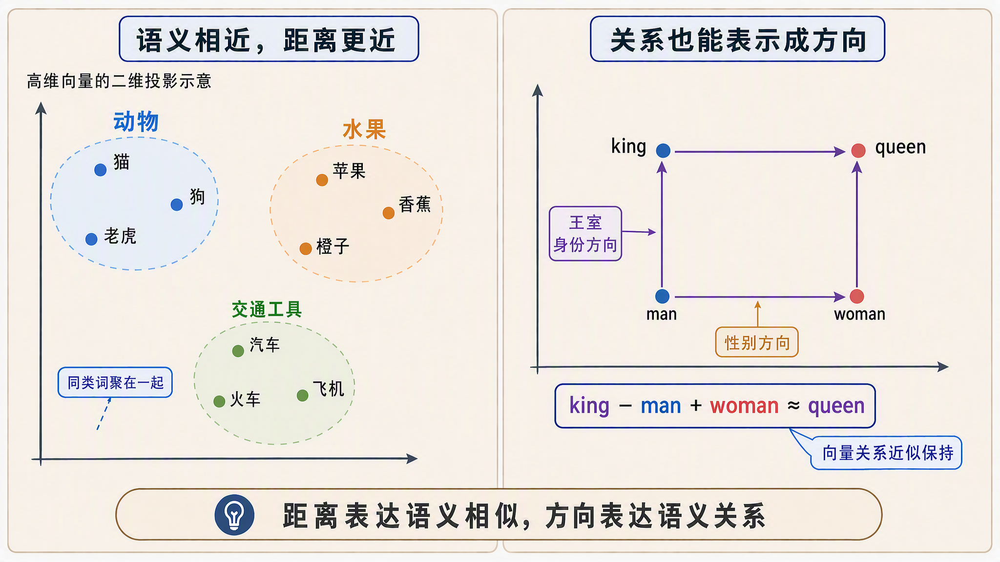
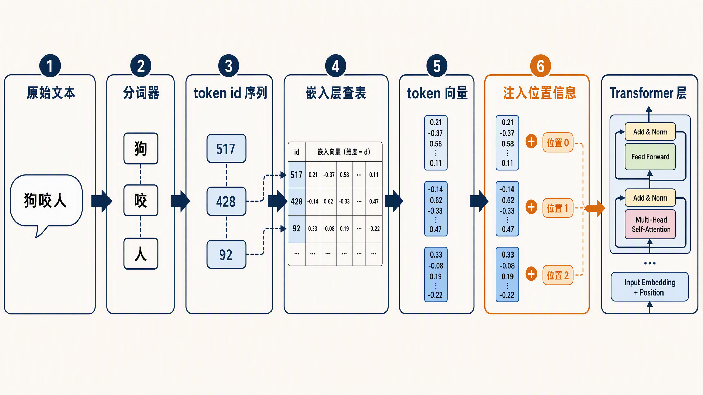
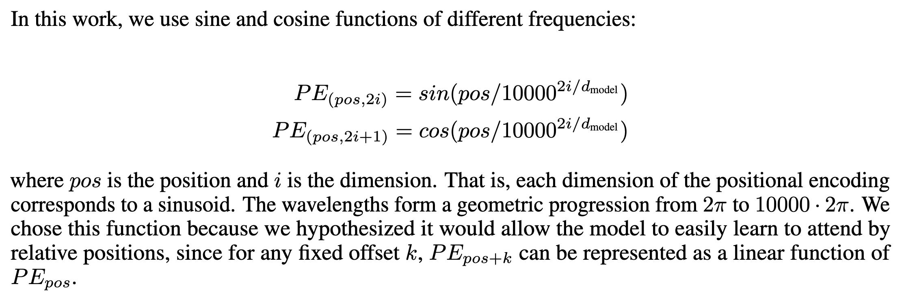
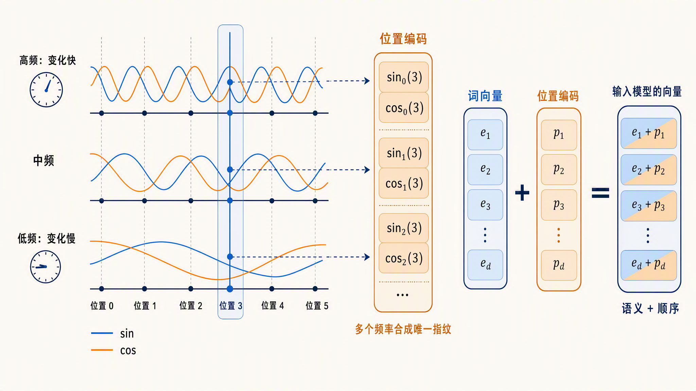
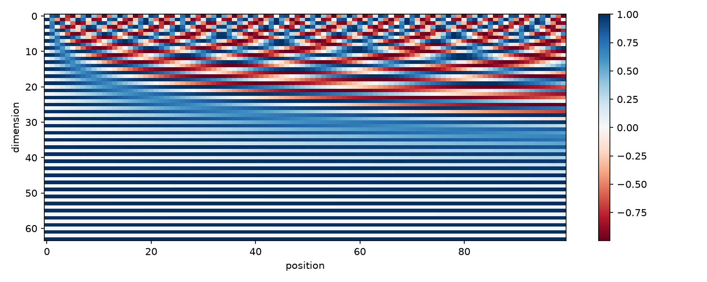
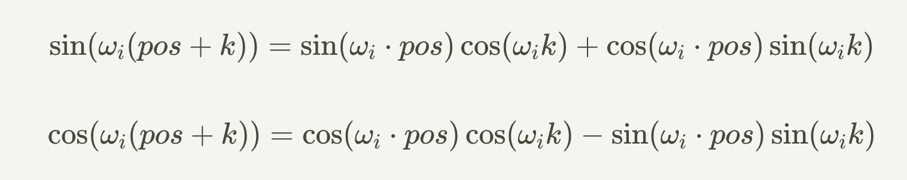
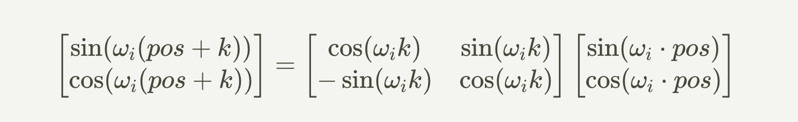
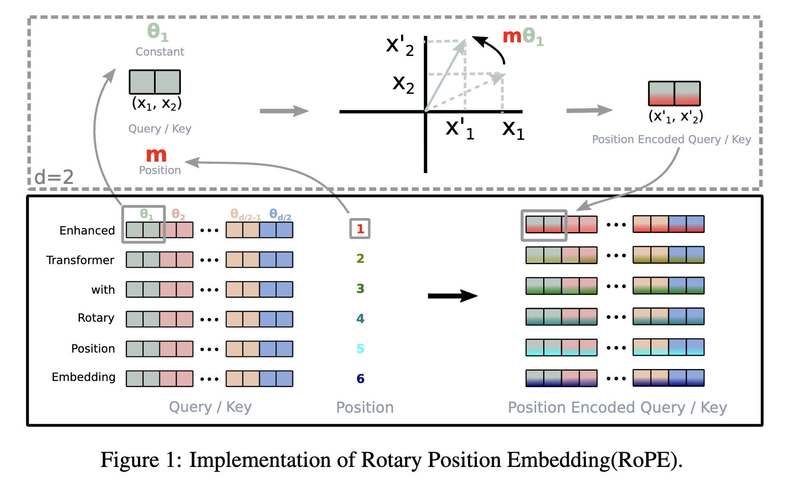

# 学习大模型推理的嵌入与位置编码

在上一篇中，我们看了分词器如何用 BPE 算法把一句话切成子词，再映射成一串整数，也就是 token id 序列。这串整数是分词阶段的终点，却不是模型计算的起点。

token id 说到底只是编号，和字典里每个词条的序号没有区别，编号本身不带任何语义信息。模型真正处理的是向量。今天这篇就来讲 token id 之后发生的事：它怎么先被嵌入层变成稠密向量，又怎么被位置编码注入顺序信息，最后才进入 Transformer 层参与计算。

## 嵌入层查表

**嵌入（Embedding）** 是把离散的 token id 映射为连续向量的过程。它的实现非常直接：就是一张形状为 `vocab_size × hidden_size` 的二维矩阵，每一行对应词表里一个 token 的向量。token id 进来，按行号取出对应那一行，查表完成，没有任何复杂运算。

以 Qwen3-0.6B 为例，它 config 里的 `vocab_size` 是 151936，隐藏层维度是 1024，所以嵌入矩阵就是一个 151936 行、1024 列的浮点数表格。上一篇讲过，这个 `vocab_size` 比词表实际条目略多，多出来的是对齐预留位，不影响查表。每个 token 被表示成一个 1024 维的**稠密向量（Dense Vector）**，即每个维度都是一个实数、没有大量零元素的向量。


这张表是在训练过程中和模型其他参数一起学出来的。学出来的结果有一个著名性质：语义相近的词，向量在空间中也相近。这就是**词向量（Word Embedding）** 的语义性。2013 年 Mikolov 等人提出 [word2vec](https://arxiv.org/abs/1301.3781)，论文里给出了一个流传至今的例子：

```text
king - man + woman ≈ queen
```

对 king 的向量减去 man 的向量、加上 woman 的向量，结果最接近的词是 queen。这说明向量里编码了性别、王室身份这类语义维度，词与词的关系变成了可以计算的向量运算。他们在随后的[另一篇论文](https://aclanthology.org/N13-1090/)里用词类比任务对这类线性关系做了系统研究，比如国家与首都、形容词比较级、动词时态都能用向量加减算出来。

词向量在语义空间里的分布大致如下图所示：



> 要注意的是，大模型词表里的单位是子词（subword）而不是完整的词，像 unbelief 会被拆成 un、belief 两个 token，各有各的向量。所以现代模型的嵌入表更像是子词向量表，词一级的语义靠模型后续层组合出来。

## 动手看看嵌入矩阵

下面我们通过一个简单的示例来体验下。用 Hugging Face transformers 加载 [Qwen/Qwen3-0.6B](https://huggingface.co/Qwen/Qwen3-0.6B)，直接看它的嵌入层：

```python
import torch
from transformers import AutoModelForCausalLM

model_name = "Qwen/Qwen3-0.6B"
model = AutoModelForCausalLM.from_pretrained(model_name, dtype=torch.float32)

# 输入嵌入层，本质就是一个 nn.Embedding
emb = model.get_input_embeddings()
print(emb.weight.shape)
```

输出：

```text
torch.Size([151936, 1024])
```

可以看到，形状正是 `vocab_size × hidden_size`。词表里 15 万多个 token，每个都有自己专属的一行向量。

再验证一下语义性。取两组词算**余弦相似度（Cosine Similarity）**，它衡量两个向量方向的接近程度，取值在 -1 到 1 之间，越接近 1 表示越相似：

```python
import torch.nn.functional as F
from transformers import AutoTokenizer

tokenizer = AutoTokenizer.from_pretrained(model_name)

def vec(word):
    # 这几个词都是单个 token，直接取出对应行的向量
    token_id = tokenizer.encode(word, add_special_tokens=False)[0]
    return emb.weight[token_id]

pairs = [("猫", "狗"), ("猫", "汽车")]
for a, b in pairs:
    sim = F.cosine_similarity(vec(a), vec(b), dim=0)
    print(f"{a} vs {b}: {sim.item():.4f}")
```

输出：

```text
猫 vs 狗: 0.4233
猫 vs 汽车: 0.1562
```

「猫」和「狗」同为动物，向量方向明显比「猫」和「汽车」更接近。词向量的语义是统计意义上的相近，绝对数值谈不上大，但相对关系是清楚的。

## 注意力不知道顺序

嵌入向量解决了语义问题，但还有一个问题没解决：顺序。

大模型的核心是注意力机制，细节我们留到下一篇展开。这里只需要知道一点：注意力计算是把一批向量放在一起两两做点积，它关心的是向量的集合，不关心谁先谁后。把输入顺序打乱，只要还是那几个向量，算出来的结果就不变。这个性质有个专门的名字，叫**置换等变（Permutation Equivariance）**：输入怎么排列，输出就怎么跟着排，计算本身对先后顺序零感知。

口说无凭，我们用 NumPy 手写一个最简注意力验证一下，Q、K、V 投影用随机矩阵代替：

> 这里的注意力实现做了大量简化，你不需要看懂每一行，注意力机制的细节下一篇会专门展开。现在只需关注实验的设计：同一批向量，打乱顺序送进去，看结果变不变。

```python
import numpy as np

rng = np.random.default_rng(0)
d = 8
Wq, Wk, Wv = (rng.normal(size=(d, d)) for _ in range(3))  # 三个 8×8 投影矩阵

def attention(x):
    # 最简自注意力：softmax(QKᵀ/√d)V
    # @ 是矩阵乘法运算符：(4,8) @ (8,8) -> (4,8)，一次算出所有 token 的投影
    # Wq, Wk, Wv 是可学习的参数（真实模型里从训练中学出来，这里用随机矩阵代替）
    q, k, v = x @ Wq, x @ Wk, x @ Wv
    # k.T 是转置，(4,8) @ (8,4) -> (4,4)，得到 4 个 query 对 4 个 key 的两两打分表
    scores = q @ k.T / np.sqrt(d)
    # softmax：对每行分数先取 exp 再归一化，转成和为 1 的权重
    # 分数越高的 key 权重越大；减去最大值是为了防止 exp 数值溢出，不改变结果
    scores = np.exp(scores - scores.max(axis=-1, keepdims=True))
    weights = scores / scores.sum(axis=-1, keepdims=True)
    return weights @ v

x = rng.normal(size=(4, d))  # 4 个 token，每个 8 维
out1 = attention(x)

perm = [2, 0, 3, 1]          # 打乱后的 token 顺序
# 花式索引：用数组当下标，按给定顺序取行
# x[perm] 等价于 [x[2], x[0], x[3], x[1]]，即打乱语序后的输入
out2 = attention(x[perm])

# argsort 求逆排列：inv[i] 表示原位置 i 的 token 被打乱到了哪里
# out2[inv] 把打乱的输出按原顺序排回去，这样才能和 out1 逐位置对比
inv = np.argsort(perm)
print(f"打乱前后的最大差异: {np.abs(out1 - out2[inv]).max():.2e}")
```

输出：

```text
打乱前后的最大差异: 1.78e-15
```

打乱后每个位置的输出，和它原来位置的输出完全一致，差异是 10⁻¹⁵ 级别的浮点误差。注意力确实对顺序没有任何感知。

这会带来一个直观的问题。「狗咬人」和「人咬狗」用的是同样的三个字，分词后 token 集合一样，查出来的向量集合也一样。如果没有位置信息，在注意力看来这两句话完全等价，但它们的含义显然相反。中文是这样，英文里也一样。

所以必须在向量进入 Transformer 之前，把顺序信息注入进去，这就是**位置编码（Positional Encoding）** 要干的事。早期的循环（RNN）和卷积（CNN）结构天然按顺序读文本，而纯注意力结构本身没有顺序概念，位置信息只能显式注入。位置编码方案的好坏，直接影响模型对语序、指代、因果这类依赖顺序的语言现象的理解能力。

从文本到 Transformer 层的完整链路如下：



位置编码的做法经历了几次演进，我们按时间线依次看。

### 正弦绝对位置编码

2017 年的 Transformer 原论文 [Attention Is All You Need](https://arxiv.org/abs/1706.03762) 用的是**正弦位置编码（Sinusoidal Positional Encoding）**。做法是给每个位置生成一个固定的向量，偶数维度填正弦值，奇数维度填余弦值，不同维度用不同频率。位置编码的维度和嵌入向量相同（都是论文里的 d_model），所以两者能直接相加，加出来的和就是带进模型的向量。

为什么偏偏是正弦和余弦？我们可以从最直接的想法倒推。给向量注入位置信息，最容易想到三个办法，但每个都有毛病：

1. **直接用位置编号**：把 0、1、2、3 这样的整数塞进向量。数值无界，位置到几千的时候，编号比嵌入值大好几个数量级，训练不稳定
2. **编号归一化**：除以序列长度压到 0 到 1 之间。数值有界了，但同一个值在不同长度的序列里含义不同，0.5 在 10 个词的句子里是第 5 个词，在 1000 个词的句子里是第 500 个词
3. **二进制编码**：把位置写成二进制数，每一位占一个维度。有界、唯一、和序列长度无关，前面几个问题都解决了，但每一位都在 0 和 1 之间硬跳变，不平滑

正弦编码可以看成二进制编码的连续版。二进制从低位到高位，翻转周期按 2、4、8、16 翻倍；正弦编码从低维到高维，波长同样按几何级数拉长，区别只是把硬跳换成了平滑的正弦波。

论文里的公式长这样：



公式里 pos 是位置编号，i 是维度编号。关键在分母 `10000^(2i/d)`，把公式换个写法 `sin(pos × ω)`，其中 `ω = 1/10000^(2i/d)`，这个 ω 就是每个维度的频率：ω 越大，pos 每增加 1，正弦波走得越快；ω 越小，波走得越慢。维度编号 i 越大，指数越大，ω 就越小。以 8 维为例，四个维度对的频率和波长如下：

| 维度对 i | 频率 ω | 波长（约多少个位置） |
| ------- | ------ | ----------------- |
| 0 | 1 | 6.3 |
| 1 | 0.1 | 63 |
| 2 | 0.01 | 628 |
| 3 | 0.001 | 6283 |

> 频率按 `ω = 1/10000^(2i/d)` 代入 i 和 d=8 算出；波长是波形走完一个周期需要的位置数，即 `2π/ω`。10000 恰好是 10⁴，d=8 时分母正好是 10 的整数次幂，所以数字格外整齐。

这就像钟表：秒针转得快，用来分辨相邻的秒；时针转得慢，用来定位大致在几点。只看一根针会有歧义，所有维度合起来，每个位置才有独一无二的指纹。



论文中的两行公式看着唬人，代码实现其实很简单。我们用一个 8 维的迷你版本，把前几个位置的编码算出来看看：

```python
import math

def sinusoidal_pe(pos, d_model=8):
    # 偶数维度填 sin，奇数维度填 cos，频率随维度指数下降
    return [
        math.sin(pos / 10000 ** (i / d_model)) if i % 2 == 0
        else math.cos(pos / 10000 ** ((i - 1) / d_model))
        for i in range(d_model)
    ]

for pos in range(4):
    print(f"位置 {pos}:", [round(x, 2) for x in sinusoidal_pe(pos)])

# 对比一下相邻位置和相隔很远的位置，编码差多少
def dist(a, b):
    return math.sqrt(sum((x - y) ** 2 for x, y in zip(a, b)))

for pos in list(range(1, 11)) + [100, 1000]:
    print(f"位置 0 和 {pos} 的距离:", round(dist(sinusoidal_pe(0), sinusoidal_pe(pos)), 2))

# 同样的间隔，换个起点再算一遍
for gap in [1, 5, 100]:
    a = dist(sinusoidal_pe(0), sinusoidal_pe(gap))
    b = dist(sinusoidal_pe(100), sinusoidal_pe(100 + gap))
    print(f"间隔 {gap}: 起点 0 算得 {a:.4f}, 起点 100 算得 {b:.4f}")
```

输出：

```text
位置 0: [0.0, 1.0, 0.0, 1.0, 0.0, 1.0, 0.0, 1.0]
位置 1: [0.84, 0.54, 0.1, 1.0, 0.01, 1.0, 0.0, 1.0]
位置 2: [0.91, -0.42, 0.2, 0.98, 0.02, 1.0, 0.0, 1.0]
位置 3: [0.14, -0.99, 0.3, 0.96, 0.03, 1.0, 0.0, 1.0]
位置 0 和 1 的距离: 0.96
位置 0 和 2 的距离: 1.69
位置 0 和 3 的距离: 2.02
位置 0 和 4 的距离: 1.86
位置 0 和 5 的距离: 1.3
位置 0 和 6 的距离: 0.66
位置 0 和 7 的距离: 0.98
位置 0 和 8 的距离: 1.7
位置 0 和 9 的距离: 2.14
位置 0 和 10 的距离: 2.15
位置 0 和 100 的距离: 2.21
位置 0 和 1000 的距离: 2.4
间隔 1: 起点 0 算得 0.9641, 起点 100 算得 0.9641
间隔 5: 起点 0 算得 1.2962, 起点 100 算得 1.2962
间隔 100: 起点 0 算得 2.2097, 起点 100 算得 2.2097
```

从运行结果我们可以看到三个规律。一是**不同维度的变化速度不同**：前两个维度变得最快，位置每加 1 数值就明显不同；越靠后的维度变得越慢，最后一对几乎不动，和上面的频率表完全对得上。二是**编码距离只和间隔有关，和起点无关**：间隔同为 1，位置 0 到 1 和位置 100 到 101 算出的距离都是 0.9641，间隔 100 时两个起点都算得 2.2097。这不是巧合，用差角公式可以严格证明：每个维度对对距离平方的贡献是 2(1 − cos(ωk))，只含间隔 k，不含起点。也就是说，正弦编码的距离结构天生就是相对的。三是**距离随间隔先升后饱和，不是越远越大**：间隔从 1 到 3 距离升到 2.02，间隔 5 又回落到 1.30，间隔 1000 也只有 2.4，之后就在这个量级振荡，不再持续增大。原因还是周期性：每个维度对的贡献最大只有 4，波形转完一圈还会回来，合起来的距离自然有界。不过有界不等于撞车：两个不同位置的编码只是距离有上限，并不会变得相同，慢速维度上总差着一截。多频率组合保证的是每个位置的编码独一无二，而不是距离随间隔无限拉大。

不过这样看还不够直观，我们可以把更多位置和维度画成一张热力图：

```python
import numpy as np
import matplotlib.pyplot as plt

d_model, max_pos = 64, 100
positions = np.arange(max_pos)[:, None]
omega = 1 / 10000 ** (2 * np.arange(d_model // 2) / d_model)
angles = positions * omega                    # (100, 32) 个角度

pe = np.zeros((max_pos, d_model))
pe[:, 0::2] = np.sin(angles)                  # 偶数维度填 sin
pe[:, 1::2] = np.cos(angles)                  # 奇数维度填 cos

plt.figure(figsize=(10, 4))
plt.imshow(pe.T, aspect="auto", cmap="RdBu")
plt.xlabel("position")
plt.ylabel("dimension")
plt.colorbar()
plt.show()
```

生成的图如下所示：



横轴是位置，纵轴是维度。低维区域条纹细密，波形高频振荡；高维区域几乎一整片不变，波长极长。每一列就是一个位置 64 个维度取值的组合，任意两列都不相同，这就是每个位置的指纹。

正弦位置编码有两个特点。一是不需要学习参数，公式直接算出来；二是位置之间存在数学上的线性关系：位置 pos + k 的编码等于位置 pos 的编码乘上一个只和 k 有关的矩阵，效果是把每个维度对旋转 k×ωᵢ 角度，模型有机会学出相对位置的概念。

这个线性关系用三角恒等式展开就能看到，对频率为 ω 的维度对：



k 固定时，`cos(ωk)` 和 `sin(ωk)` 都是常数，所以 pos + k 的编码恰好是 pos 的编码在每个维度对上旋转 ωk 角度：



不过它是**绝对位置编码（Absolute Positional Encoding）**，每个位置的编码只跟自己的序号有关，加在语义向量上之后，语义和位置混在同一个向量空间里。

### RoPE 旋转位置编码

现在主流的开源模型，包括 Qwen、Llama、DeepSeek、Gemma 等，用的都是 **RoPE（Rotary Positional Embedding，旋转位置编码）**。它由苏剑林在 2021 年的 [RoFormer 论文](https://arxiv.org/abs/2104.09864)中提出，论文标题是 *Enhanced Transformer with Rotary Position Embedding*。

上一节我们看到，正弦编码里位置平移 k 等价于把每个维度对旋转一个固定角度。RoPE 把这个关系反过来用：不给嵌入向量加位置信息，而是直接按位置旋转向量。注意力机制里，每个 token 的向量会被变换成 query 和 key 两种角色，靠它们的内积来两两打分。RoPE 的做法是把 query 和 key 向量按维度两两分组，每一组看成一个二维平面上的小箭头。位置为 m 的 token，把它的每组箭头都旋转一个与 m 成正比的角度，位置越靠后，转得越多。不同维度组的旋转速度不一样，类似钟表上时针、分针、秒针各转各的，所有维度组的旋转速度由同一个基底频率推出来。要注意旋转只发生在每层注意力的 query 和 key 上，嵌入层出来的向量本身不动。

旋转的效果如下图所示：



旋转操作用矩阵写出来，就是线性代数里标准的二维旋转矩阵，每个维度对各乘一个：

```text
R(θ) = [ cos θ  −sin θ ]
       [ sin θ   cos θ ]
```

角度 θ = m × ωᵢ，由 token 的位置 m 和这个维度对的频率 ωᵢ 共同决定，位置越靠后，角度越大。是不是很眼熟？和上一节正弦编码用的是一样的思想，区别只在：正弦编码把 sin、cos 的值直接**加**到嵌入向量上，RoPE 把它们组成旋转矩阵**乘**在 query 和 key 上。

为什么这样做有效？关键在于注意力算的是 query 和 key 的内积，而两个向量各自旋转之后，它们的内积只取决于**转过的角度差**。位置 m 的 query 和位置 n 的 key，内积里自动带上了 m - n 这个相对位置。模型不用关心每个 token 的绝对序号，就能知道两个 token 之间隔了多远。相对位置信息就这样自然地进了注意力分数。

我们可以用代码验证一下「内积只取决于角度差」：

```python
def rotate(x, y, pos, omega=1.0):
    # 把二维箭头 (x, y) 按位置旋转 pos * omega 角度
    angle = pos * omega
    return (x * math.cos(angle) - y * math.sin(angle),
            x * math.sin(angle) + y * math.cos(angle))

def dot(a, b):
    # 二维向量的点积（内积）：对应分量相乘再求和
    # 几何意义是 |a| × |b| × cos(夹角)，方向越一致点积越大
    return a[0] * b[0] + a[1] * b[1]

q = (1.0, 0.0)
k = (0.8, 0.6)

# 两组不同的绝对位置，相对距离都是 2
print(round(dot(rotate(*q, 5), rotate(*k, 3)), 4))
print(round(dot(rotate(*q, 50), rotate(*k, 48)), 4))

# 相对距离变成 5，分数跟着变
print(round(dot(rotate(*q, 5), rotate(*k, 0)), 4))
```

输出：

```text
0.2127
0.2127
-0.3484
```

前两个数一模一样：query 在位置 5、key 在位置 3，和 query 在位置 50、key 在位置 48，只要相对距离都是 2，注意力打出的分完全相同，绝对位置被旋转消掉了。第三个数说明相对距离一变，分数立刻跟着变。这里只看了一对维度，真实的 RoPE 是多对维度各自按不同速度旋转，总内积是所有维度对的结果之和，每一对都只和 m - n 有关。

> 实现时有一个细节：维度配对有两种方式，GPT-J 式的相邻配对（第 0、1 维一组，第 2、3 维一组）和 GPT-NeoX、Llama 式的前后半配对（第 0 维和第 d/2 维一组）。两者只是维度排列顺序不同，数学上完全等价，内积结果不受影响。

将 RoPE 和正弦绝对位置编码放在一起做个对比：

| 对比项 | 正弦绝对位置编码 | RoPE |
| ---- | ---- | ---- |
| 作用对象 | 加在嵌入向量上 | 旋转 query 和 key 向量 |
| 位置类型 | 绝对位置 | 内积中自然体现相对位置 |
| 可学习参数 | 无 | 无 |
| 语义与位置 | 混在同一向量空间 | 各走各的通道 |
| 典型使用者 | 2017 年原始 Transformer | Qwen、Llama、DeepSeek 等 |

和正弦编码相比，RoPE 不是把位置向量加到嵌入上，而是直接作用在注意力的 query、key 上，语义向量和位置信息互不污染。加上实现简单、没有额外参数，它很快成了新模型的默认选择。苏剑林本人的博客[科学空间](https://spaces.ac.cn/archives/8265)上有一系列推导文章，想深入数学细节的同学可以去读。英文资料推荐 EleutherAI 的 [Rotary Embeddings: A Relative Revolution](https://blog.eleuther.ai/rotary-embeddings/)，它从「内积只依赖相对位置」这个设计目标出发反推出旋转形式，他们的实验还发现 RoPE 的训练收敛更快。

RoPE 还有一个性质很符合直觉：两个 token 的相对距离越远，旋转带来的内积差异越杂乱，注意力分数整体呈衰减趋势。也就是说，模型天然更关注离自己近的 token。这种预先写进模型结构里的倾向叫**归纳偏置（Inductive Bias）**，它和自然语言的局部性是一致的。

这个衰减趋势也可以用代码验证。取一个最干净的情形：q 和 k 在每个维度对上都是同向的单位向量，旋转后的内积就等于各维度对 cos((m − n) × ωᵢ) 之和，直接看它随距离的变化：

```python
import numpy as np

d = 128
omega = 1 / 10000 ** (2 * np.arange(d // 2) / d)  # 64 个维度对的频率

for dist in [0, 1, 5, 10, 20, 50, 100, 200, 400]:
    score = np.cos(dist * omega).sum() / (d // 2)  # 归一化，满值为 1
    print(f"距离 {dist}: {score:.3f}")
```

输出：

```text
距离 0: 1.000
距离 1: 0.970
距离 5: 0.737
距离 10: 0.669
距离 20: 0.608
距离 50: 0.546
距离 100: 0.477
距离 200: 0.306
距离 400: 0.278
```

距离 0 时内积满值 1，距离拉到 400 时降到 0.28，一路往下。真实的 q、k 方向各异，曲线会有波动，但衰减的整体趋势一致。

### 其他位置编码

除了正弦编码和 RoPE 这两条线，历史上还有两条路线也简单了解下。BERT 和早期的 GPT 用的是**学习式绝对位置编码（Learned Absolute Positional Embedding）**，给每个位置编号也配一张可训练的查表，和词嵌入一样从数据里学。其实 Transformer 原论文就对比过这条路线，实验发现学习式和正弦版的效果几乎一样，最后选正弦版是出于一个前瞻考虑：公式编码有可能外推到比训练时更长的序列。学习式有个绕不过去的限制：表的长度在训练时就定死了，想支持更长的文本就得重新学，灵活性不如公式编码，后来主流模型基本都放弃了这条路线。

另一条是 **ALiBi（Attention with Linear Biases，线性偏置注意力）**，论文标题叫 [*Train Short, Test Long*](https://arxiv.org/abs/2108.12409)。它不改任何向量，直接在注意力分数上减去一个和距离成正比的惩罚项，距离越远扣分越多，把「优先关注近处」写死在公式里。BLOOM、MPT 等模型采用过它，长度外推表现不错，但长程依赖场景下不如 RoPE 灵活，近年的新模型里已经很少见了。

几种代表性方案讲完，回过头总结下，一个好的位置编码应该满足下面这些条件：

* **唯一性**：每个位置要有独一无二的编码，不同位置不能撞车
* **有界性**：编码数值要有界，不能随位置编号无限膨胀，否则会淹没语义信息
* **相对性**：模型关心的往往是两个词隔多远，编码最好能表达相对距离
* **可外推**：训练时没见过的更长序列，推理时编码依然合理
* **确定性**：同样的位置永远算出同样的编码

用这几条标准对照一遍：学习式编码输在可外推，表长训练时就定死了；ALiBi 把相对性简化成线性距离惩罚，换来了外推，牺牲了长程依赖的灵活性；正弦编码五条都满足，但相对位置藏在加法里，要靠模型自己学出来；RoPE 也是五条都满足，相对位置还直接进了内积，这就是它成为主流的原因。

## 位置编码与上下文长度

位置编码还决定了一件工程上很实际的事：模型能处理多长的上下文。

训练时模型只见过有限范围内的位置。比如训练最大长度是 4096，那么 RoPE 里超出 4096 的旋转角度模型从没见过。推理时硬塞更长的文本，注意力分数会乱掉，生成质量明显下降。这就是位置编码的**外推（Extrapolation）** 问题，即模型在训练长度之外的表现。

我们看 Qwen3-0.6B 的配置里和位置相关的两个字段：

```python
print(model.config.max_position_embeddings)
print(model.config.rope_parameters["rope_theta"])  # transformers 4.x 里是 config.rope_theta
```

输出：

```text
40960
1000000
```

其中 `max_position_embeddings` 是模型位置编号的上限，Qwen3-0.6B 这里是 40960，比官方标称的 32K 原生上下文略留了余量。`rope_theta` 就是上一节说的那个基底频率，各维度组的旋转速度都由它推出来，Qwen3 把它从早期模型常用的 10000 调大到了 1000000，让高频维度的旋转放缓，为长上下文留余地。

围绕外推问题有一系列改进方法。[位置插值（Position Interpolation，PI）](https://arxiv.org/abs/2306.15595) 把长文本的位置等比压缩回训练窗口内；**NTK-aware 缩放** 调整 RoPE 的基底频率，让不同转速的维度组得到不同程度的拉伸。NTK 这个名字来自**神经正切核（Neural Tangent Kernel）** 的理论启发，最早是 Reddit 上的一篇社区帖子提出的。**YaRN** 名字是 Yet another RoPE extensioN 的缩写。它在 NTK 思路上对高频和低频分量区别处理，再加一个注意力温度系数，用少量微调就能把上下文窗口扩到训练长度的好几倍。[YaRN 论文](https://arxiv.org/abs/2309.00071)里把 LLaMA 系列扩到了 128K。Qwen3 官方也说明了通过 YaRN 可以把上下文从 32K 扩到 128K。这些方法涉及不少公式和细节，我们这里就点到为止了，感兴趣的同学可以进一步查阅相关资料。

## 小结

今天我们学习了 token id 之后的第一步：

1. **嵌入层**是一张 `vocab_size × hidden_size` 的查表，把 token id 变成稠密向量；训练让语义相近的词向量相近，经典的 king - man + woman ≈ queen 就是这种语义性的体现
2. 动手用 Qwen3-0.6B 验证了嵌入矩阵的形状，并用余弦相似度对比了语义相近词与无关词的差异
3. 注意力是**置换等变**的，本身不包含顺序信息，我们用 NumPy 最简注意力做了实验：打乱输入，输出只是跟着重排，逐位置的值完全不变
4. 好的位置编码有五条标尺：唯一、有界、能表达相对距离、可外推、确定。正弦编码可以看成二进制编码的连续版，用一组几何级数的频率给每个位置生成独一无二的指纹
5. RoPE 把「旋转」从正弦编码的副产品变成了主角：按位置旋转 query 和 key，让相对位置自然体现在内积里，我们还用代码验证了它的距离衰减性质
6. 位置编码限制了上下文长度，位置插值、NTK、YaRN 等方法通过调整位置或旋转频率做长度外推

向量准备好了，位置信息也注入进去了，接下来就是真正的计算核心：这些向量进入 Transformer 层之后，注意力机制到底是怎么两两打分的，前向传播的完整数据流又长什么样。我们明天继续。

## 参考

* [Qwen3-0.6B Hugging Face 模型页](https://huggingface.co/Qwen/Qwen3-0.6B)
* [word2vec 论文：Efficient Estimation of Word Representations in Vector Space](https://arxiv.org/abs/1301.3781)
* [词类比任务论文：Linguistic Regularities in Continuous Space Word Representations](https://aclanthology.org/N13-1090/)
* [Transformer 原论文：Attention Is All You Need](https://arxiv.org/abs/1706.03762)
* [RoFormer 论文：Enhanced Transformer with Rotary Position Embedding](https://arxiv.org/abs/2104.09864)
* [ALiBi 论文：Train Short, Test Long](https://arxiv.org/abs/2108.12409)
* [Round and Round We Go! 论文：RoPE 机制分析](https://arxiv.org/abs/2410.06205)
* [位置插值论文：Extending Context Window of Large Language Models](https://arxiv.org/abs/2306.15595)
* [YaRN 论文：Efficient Context Window Extension of Large Language Models](https://arxiv.org/abs/2309.00071)
* [苏剑林博客：博采众长的旋转式位置编码](https://spaces.ac.cn/archives/8265)
* [EleutherAI 博客：Rotary Embeddings: A Relative Revolution](https://blog.eleuther.ai/rotary-embeddings/)
* [Malte Brenndörfer 博客：正弦位置编码与词序](https://mbrenndoerfer.com/writing/sinusoidal-position-encoding-transformers-word-order)
* [John Robinson 博客：位置问题与正弦编码](https://www.storminthecastle.com/posts/01_position_problem_sinusoidal/)
* [TheoremPath：位置编码专题](https://theorempath.com/topics/positional-encoding)
* [Aakash Kumar Nain 博客：RoPE 数学详解](https://aakashkumarnain.github.io/posts/ml_dl_concepts/rope.html)
* [Reddit：NTK-aware Scaled RoPE 原帖](https://www.reddit.com/r/LocalLLaMA/comments/14lz7j5/ntkaware_scaled_rope_allows_llama_models_to_have/)
