# 学习大模型推理的前向传播：Transformer 与注意力机制

在上一篇中，我们把一段文本切成了 token，查嵌入表把每个 token 变成向量，又讲了两种注入位置信息的做法：正弦编码直接加在嵌入向量上，RoPE 则作用在注意力计算里的 Q 和 K 上。到这里，一段文本已经变成一串带语义的向量，到达了模型的入口。

不过这串向量还只是原材料。接下来它要穿过几十层结构完全相同的 **Transformer Block（Transformer 块）**，每过一层就被改写一次，最后被映射成词表大小的分数，模型才能从中挑出下一个 token。这个从输入向量一路算到输出分数的过程，就是 **前向传播（Forward Pass）**。它是整个推理过程的核心计算，今天我们就来学习这块知识。

## 前向传播全景

先看整体路线图：

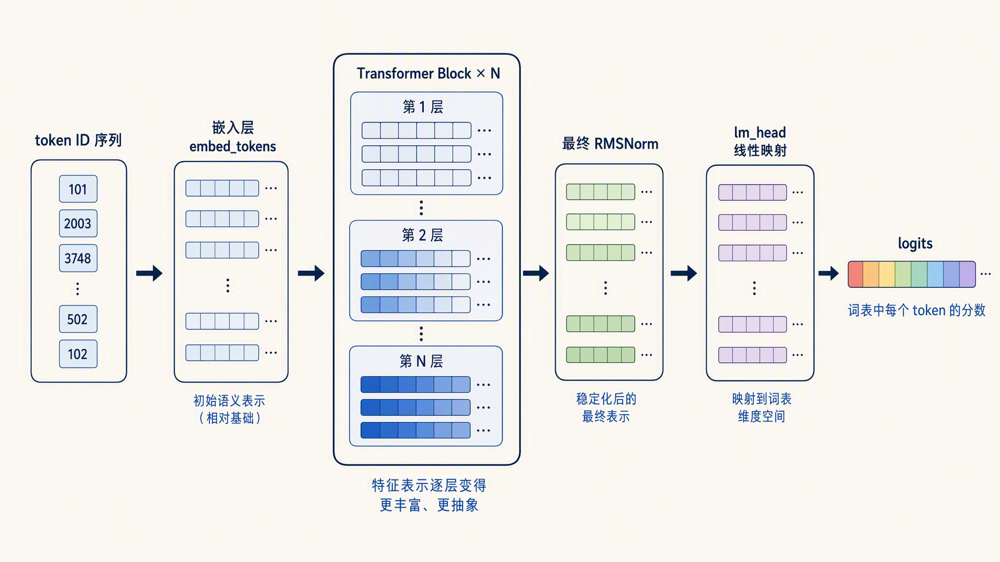

以 Qwen3-0.6B 为例走一遍这条链路：token id 先经过嵌入层，查表变成 1024 维的向量；然后向量依次穿过 28 层 Transformer Block，每一层的输入输出都是 1024 维，形状不变，内容却被改写一次；走出最后一层后先过一次 RMSNorm，最后由 lm_head 把 1024 维映射成 151936 个分数，词表里每个候选 token 各得一分。可以看到，向量只在首尾两头改变形状，中间的加工全部在 Block 里完成。

整条链路里，真正让模型变聪明的就是中间那 N 层 Block。Qwen3-0.6B 这样的小模型就有 28 层，更大的模型可以有 60 层、80 层甚至更多。每一层结构相同、参数不同，向量每过一层就被加工一次，表示越来越抽象。

今天的主要任务就是把一个 Block 拆开，看清里面的两个核心组件：注意力机制和前馈网络。

## 原始 Transformer 的结构

今天主流大模型的 Block 不是凭空设计的，它是从 2017 年 Transformer 原始论文 [Attention Is All You Need](https://arxiv.org/abs/1706.03762) 的架构一路演化来的。先看原文的经典架构图：

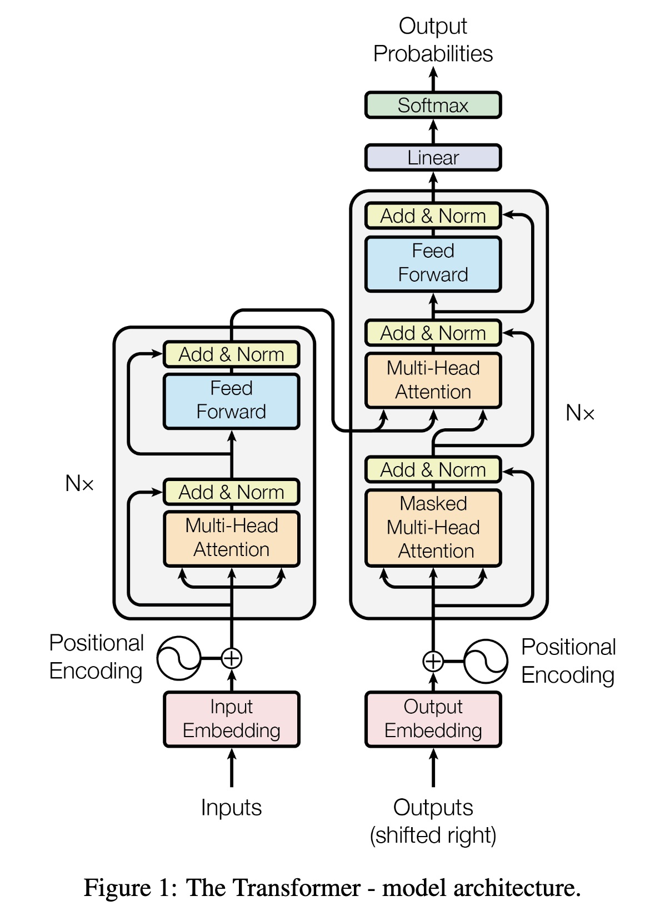

原始 Transformer 是为机器翻译设计的，整个模型分成左右两半。左边是 **编码器（Encoder）**，负责读入源语言句子；右边是 **解码器（Decoder）**，负责逐个生成目标语言的词。图底部的嵌入层加位置编码，就是上一篇讲的内容；最上方的 Linear 加 Softmax，则对应今天的 lm_head 和 softmax，我们后面学习。

重点看中间的 Block。编码器的 Block 分两段：多头注意力加前馈网络；解码器的 Block 分三段：带掩码的多头注意力、交叉注意力、前馈网络。**交叉注意力（Cross Attention）** 让解码器在生成每个词时参考编码器读到的源句子。每一段后面都跟着一个 Add & Norm，Add 是把子层的输出和输入做残差相加，Norm 是对相加的结果做 LayerNorm 归一化。注意这个顺序：先相加、再归一化，归一化作用在残差相加之后的主干上，这个写法叫 **Post-Norm（后置归一化）**。

不过，如今的大模型几乎都去掉了编码器，也就是 **decoder-only（仅解码器）** 架构。核心原因是它的预训练目标很简单，就是不断地预测下一个 token，海量文本不需要任何标注就能直接训练，规模容易堆上去。理解类任务也都可以改写成续写的形式，把问题写进输入、让模型接着写答案，一个模型就可以同时覆盖理解和生成。翻译这类原本适合编码器-解码器架构的任务，用续写同样能完成，编码器-解码器架构慢慢就成了少数派。

编码器没了，交叉注意力自然也被拿掉，一个 Block 就剩下两段：带掩码的多头注意力加前馈网络。接下来就看看这个两段式 Block 在今天的大模型里长什么样。

## 一个 Block 的内部结构

从原始架构到今天的主流开源大模型（LLaMA、Qwen、DeepSeek 等），Block 又做了两处改进：LayerNorm 换成了 RMSNorm，归一化从子层之后挪到了子层之前，也就是 **Pre-Norm（前置归一化）**。改完之后，各家的 Block 长得几乎一模一样：

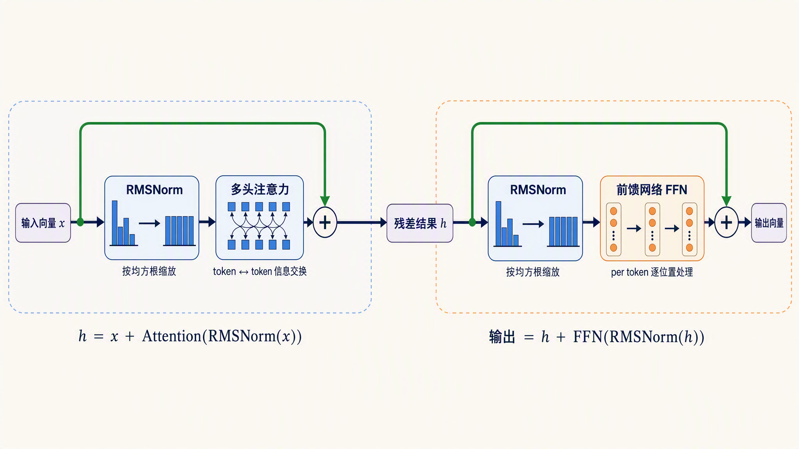

先不管具体怎么算，沿着箭头把这张图走一遍。一个 Block 分成前后两个阶段：前半段让 token 通过注意力交换信息，后半段让每个 token 进入前馈网络单独加工。

输入向量 `x` 先经过 RMSNorm，再进入多头注意力；注意力的结果和未经处理的 `x` 相加，得到中间结果 `h`。接着 `h` 再经过一次 RMSNorm 和前馈网络，处理结果与原来的 `h` 相加，得到这个 Block 的最终输出。写成两行就是：

```text
h    = x + Attention(RMSNorm(x))
输出 = h + FFN(RMSNorm(h))
```

图中的黑色横线是正常的计算路径，绿色线路则绕过子层、直接连到加号。几十个 Block 叠起来时，每一层都重复这两次“先归一化、再计算、最后与原输入相加”的过程。

这条路线里包含三个搭建 Block 骨架的关键概念：绿色旁路叫残差连接，两次缩放操作叫 RMSNorm，而“归一化位于子层之前”的摆放方式就叫 Pre-Norm。下面按这个顺序逐个拆开。

### 残差连接：给信息留一条直通旁路

先看 **残差连接（Residual Connection）**。图里两条从上方绕过子层、汇入加号的绿色旁路就是残差连接，写法只有一行：

```text
输出 = 输入 + 子层(输入)
```

这里的 `子层(输入)` 表示把输入向量交给子层（注意力或前馈网络）计算后得到的结果，可以把它看成一次函数调用。也就是说，子层不直接输出加工结果，而是输出一个修改量，叠加在原始输入上。原始信息始终原样保留在结果里，子层只需要学习该怎么改。

为什么需要这条旁路？这和训练有关。神经网络训练时靠 **梯度（Gradient）** 来更新参数，梯度可以理解为从输出端一路传回输入端的修正信号，告诉每个参数该往哪个方向调。这个信号每穿过一层都会被削弱一点，几十层叠下来，传到最前面几层时已经所剩无几，前面的层就学不动了，这就是梯度消失问题。

有了残差连接，情况就不一样了：加法这条路上没有任何变换，修正信号可以顺着旁路几乎无损地传回第一层，深层网络才训得动。这个技巧出自 2015 年何恺明等人的 [ResNet 论文](https://arxiv.org/abs/1512.03385)，原本用在 152 层的图像网络上，后来被 Transformer 继承，成了所有深层网络的标准配置。

可以打个比方：残差连接像传阅改稿，每个子层都在原稿上批注修改，原稿本身一直在；没有残差连接就像每层都把稿子重写一遍再往下传，传了几十层，原稿早就面目全非了。

### RMSNorm：把数值缩放回稳定范围

残差旁路保住了原始信息，但主路径上的数值还需要保持稳定，这就是图中两个归一化模块的作用。向量每过一层子层，数值范围都会漂移，有的维度越乘越大，有的越压越小。几十层累积下来，数值可能大到溢出，也可能小到丢失精度，计算就不稳定了。归一化的作用就是定期把向量拉回一个稳定的数值范围。

前面讲原始 Transformer 时提过，它的 Add & Norm 里用的归一化方法是 **[LayerNorm（层归一化）](https://arxiv.org/abs/1607.06450)**。LayerNorm 分两步：先减均值，再除以标准差，相当于把考试成绩换算成标准分。

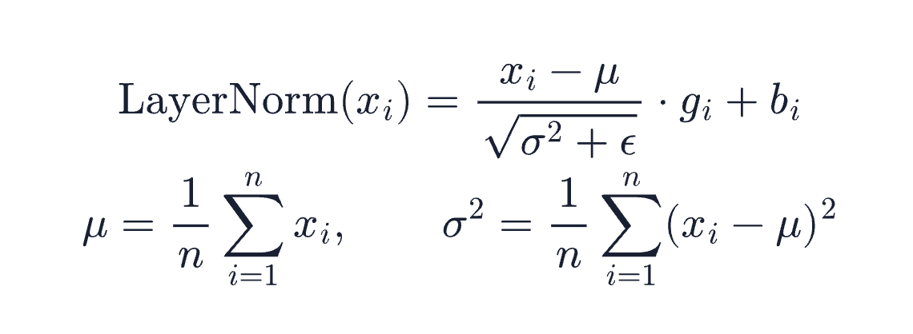

效果是没啥问题，但每一步都要算均值和标准差两个统计量。后来 2019 年的 [RMSNorm 论文](https://arxiv.org/abs/1910.07467) 提出了一个简化：砍掉减均值这一步，只保留缩放，相当于直接按总分折算成百分比。少算一个统计量，计算更省，效果不降，现在主流模型都用它替代了 LayerNorm。

**RMSNorm（Root Mean Square Layer Normalization，均方根层归一化）** 的做法很朴素：算出整个向量的均方根，然后每个维度都除以它，等比缩放：

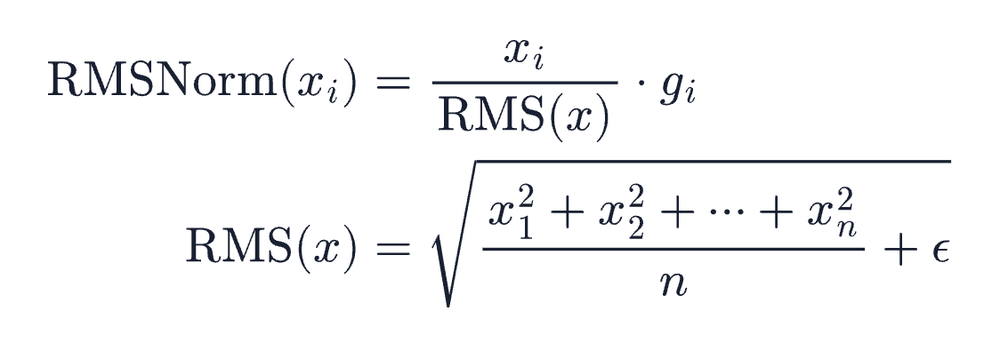

其中 g 是一组可学习的缩放系数，每个维度一个，归一化之后由模型自己决定每个维度再放大多少；ε 是一个很小的数，防止除零。

写成代码也就几行：

```python
import torch

def rms_norm(x, weight, eps=1e-6):
    rms = torch.sqrt(x.pow(2).mean(dim=-1, keepdim=True) + eps)
    return x / rms * weight

x = torch.tensor([1.0, 2.0, 3.0, 4.0])
print(rms_norm(x, torch.ones(4)))
```

输出结果：

```text
tensor([0.3651, 0.7303, 1.0954, 1.4606])
```

可以看到，各维度的比例没变，但整体尺度被收回到了 1 附近。不管输入向量的数值飘到多大，过完 RMSNorm 都会回到这个量级。

### Pre-Norm：归一化放在子层之前

知道 RMSNorm 做什么之后，最后还要回答一个问题：它应该放在哪里？原始 Transformer 用的是 **Post-Norm（后置归一化）**，先算子层、加残差，最后归一化；现在主流模型用的 **Pre-Norm（前置归一化）** 则把归一化挪到子层之前：

```text
Post-Norm: 输出 = RMSNorm(输入 + 子层(输入))
Pre-Norm:  输出 = 输入 + 子层(RMSNorm(输入))
```

两者对比图如下所示：

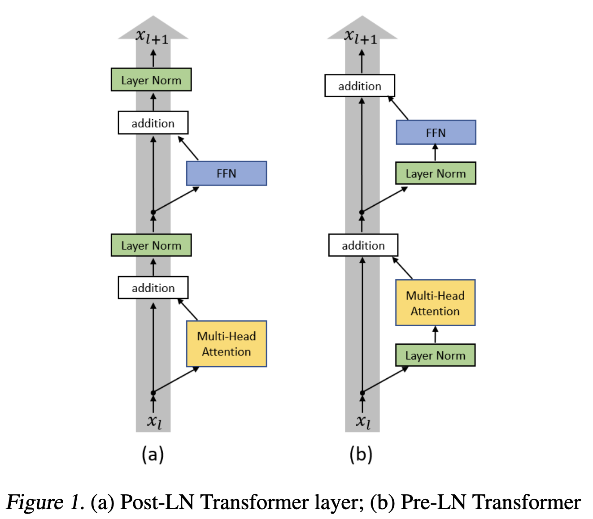

区别看着只是顺序，影响却不小。Post-Norm 里归一化卡在残差旁路上，修正信号回传时每过一层都要被重新缩放一次，层数一深训练就容易不稳，需要很小心地调参才能训起来。Pre-Norm 把归一化挪进子层内部，残差旁路从第一层直通最后一层，信号回传畅通无阻。微软 2020 年的论文 [On Layer Normalization in the Transformer Architecture](https://arxiv.org/abs/2002.04745) 从梯度的角度对比了这两种结构，证明了 Pre-Norm 的梯度更稳定，后来的大模型几乎全部采用了 Pre-Norm 结构。

到这里，Block 的骨架就清楚了：残差连接负责保留原始信息和打通信号通路，RMSNorm 负责稳定数值尺度，Pre-Norm 则规定 RMSNorm 要放在子层之前。

搞清楚这些基础概念之后，我们再来看看骨架中真正加工信息的两个核心组件。前半段的**注意力机制**横向连接整段序列，让不同 token 互相查找和交换信息；后半段的**前馈网络（FFN）**不再混合 token，而是对每个位置的向量独立做非线性变换。两者一个负责“交流”，一个负责“思考”，共同完成一层 Block 的更新。下面先学习注意力，再回头看前馈网络。

## 注意力机制

先看第一个核心组件：注意力。它的计算可以拆成几步：给每个 token 生成 Query、Key、Value 三个向量，用 Query 和 Key 算注意力分数，再按分数对 Value 加权求和。下面一步步拆开看。

### Query、Key、Value

进入注意力子层后，每个 token 的向量会分别乘以三个投影矩阵，得到三个新向量：**Query（查询）**、**Key（键）**、**Value（值）**。投影矩阵就是一组可学习的参数，向量乘上去相当于做一次坐标变换，让同一个 token 能够以三种不同的身份参与计算。

可以用查资料来类比这三个角色：

* **Query**：这个 token 想找什么信息，相当于读者手里的问题
* **Key**：这个 token 能提供什么信息的索引，相当于每本书封底的标签
* **Value**：这个 token 实际携带的内容，相当于书的正文


**注意力分数**就是 Query 和 Key 的点积。点积是把两个向量对应位置相乘再相加，比如 (1, 2) 和 (1, 0) 的点积是 1×1+2×0=1。点积越大，说明两个向量方向越一致，也就是 Query 想找的和 Key 标注的越匹配。得到分数之后，再按分数对所有 token 的 Value 加权求和，信息就完成了交换。

> 拿到 Q 和 K 之后、算分数之前，其实还有一步：上一篇讲的 RoPE 就是在这里登场的，它按位置把 Q 和 K 的维度两两配对做旋转，位置信息由此进入注意力计算。V 不参与旋转，只负责携带内容。

### 缩放点积注意力

把上面的过程写成公式，就是原始 Transformer 论文里提出的 **缩放点积注意力（Scaled Dot-Product Attention）**：

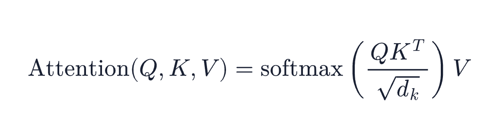

逐项解释一下：

* `QK^T`：拿每个 token 的 Q 和所有 token 的 K 做点积，得到一个 N×N 的分数矩阵，N 是序列长度。矩阵第 i 行第 j 列，表示第 i 个 token 对第 j 个 token 的关注程度
* `√d_k`：d_k 是 Key 向量的维度。维度越高，点积的结果天然越大；点积太大，softmax 会被推到梯度接近 0 的饱和区，训练就学不动了。除以 √d_k 可以把分数的方差拉回到 1 附近，让 softmax 工作在敏感区间
* `softmax`：对每一行做归一化，把分数变成和为 1 的权重。softmax 的做法是先对每个分数取指数（放大差距、保证非负），再除以整行的总和，这样每个权重都在 0 到 1 之间，加起来正好等于 1
* 乘 `V`：按权重对所有 token 的 Value 加权求和，得到每个位置融合了上下文之后的新向量

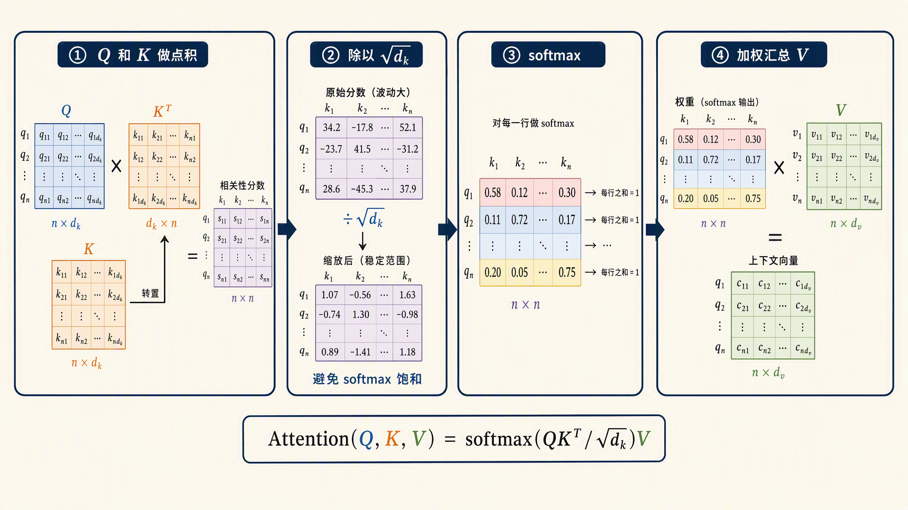

### 手算一个小例子

公式看着抽象，我们拿 4 个 token 的小例子亲手算一遍。假设输入是「我 爱 吃 苹果」，为了能手算，把向量的维度压到 2。假设每个 token 的向量过完投影矩阵后，得到的 Q、K、V 如下：

| token | Query | Key | Value |
| ----- | ----- | --- | ----- |
| 我 | (1, 2) | (1, 0) | (1, 0) |
| 爱 | (2, 1) | (0, 1) | (0, 1) |
| 吃 | (3, 1) | (1, 1) | (2, 1) |
| 苹果 | (1, 1) | (2, 0) | (1, 2) |

两两点积，得到 4×4 的注意力分数矩阵：

| 分数 | K: 我 | K: 爱 | K: 吃 | K: 苹果 |
| ---- | ----- | ----- | ----- | ------- |
| **Q: 我** | 1 | 2 | 3 | 2 |
| **Q: 爱** | 2 | 1 | 3 | 4 |
| **Q: 吃** | 3 | 1 | 4 | 6 |
| **Q: 苹果** | 1 | 1 | 2 | 2 |

以「吃」这一行为例验算一下：Q(吃) = (3, 1)，它和四个 Key 的点积分别是 3×1+1×0=3、3×0+1×1=1、3×1+1×1=4、3×2+1×0=6。

读这一行就能看到一个有意思的现象：「吃」对「苹果」的分数最高（6），其次是它自己（4）和「我」（3），对「爱」几乎不感兴趣（1）。这和我们的语言直觉吻合，一个动词最关心的问题就是谁在吃、吃什么。

接着按公式走。这里 d_k = 2，每个分数先除以 √2 ≈ 1.41，再对整行做 softmax，「吃」这一行的权重变成：

| 关注对象 | 我 | 爱 | 吃 | 苹果 |
| -------- | --- | --- | --- | ----- |
| 权重 | 0.086 | 0.021 | 0.175 | 0.718 |

可以看到，「吃」把大约 72% 的注意力给了「苹果」，18% 留给自己，9% 给了「我」。最后拿这组权重对四个 token 的 Value 加权求和：0.086×(1, 0) + 0.021×(0, 1) + 0.175×(2, 1) + 0.718×(1, 2) = (1.15, 1.63)，这就是「吃」这个位置的新向量，它里面已经揉进了主语和宾语的信息。

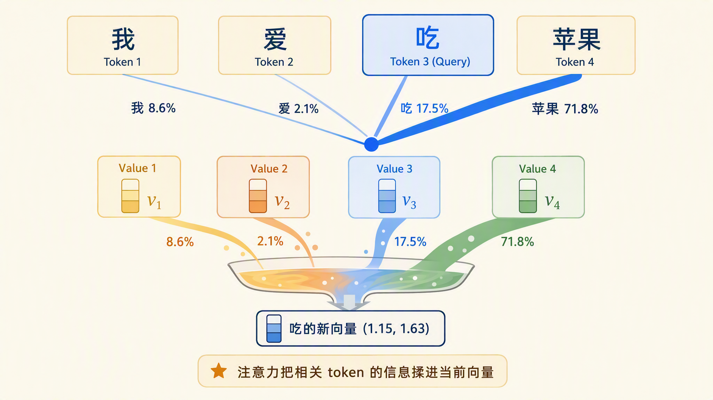

### 因果掩码

上面的例子里有一个破绽：「吃」在算注意力时看到了排在它后面的「苹果」。这在真实生成中是不允许的。模型是一个 token 一个 token 往外生成的，在「吃」这个位置决定下一个词的时候，「苹果」还不存在。如果训练时允许模型看未来，它就学会了抄答案，生成时必然露馅。

解决办法是 **因果掩码（Causal Mask）**：在 softmax 之前，把分数矩阵的上三角全部置为负无穷。负无穷经过 softmax 后权重变成 0，相当于把这些位置直接屏蔽：

| 分数 | K: 我 | K: 爱 | K: 吃 | K: 苹果 |
| ---- | ----- | ----- | ----- | ------- |
| **Q: 我** | 1 | -inf | -inf | -inf |
| **Q: 爱** | 2 | 1 | -inf | -inf |
| **Q: 吃** | 3 | 1 | 4 | -inf |
| **Q: 苹果** | 1 | 1 | 2 | 2 |

「我」只能看自己，「爱」能看前两个，「吃」能看前三个。重新算「吃」这一行，只对前三个分数（3、1、4）做缩放和 softmax，权重变成大约 0.306、0.074、0.620，「吃」的注意力就收敛到了它自己和「我」身上。加权求和得到的新向量是 0.306×(1, 0) + 0.074×(0, 1) + 0.620×(2, 1) = (1.55, 0.69)，和没加掩码时的 (1.15, 1.63) 对比，「苹果」的贡献被完全挡掉了。

每个位置只看得到自己和左边的 token，这就是 GPT 这类 decoder-only 模型的标准约束。它保证了训练时的计算方式和生成时一致。

### 多头注意力

上面演示的注意力只有一个头，也就是一套 Q、K、V 投影算一份注意力分数。一个头只能学一种关注模式，比如例子里它学会了动词找宾语，但一句话里值得学的关系还有很多：指代、修饰、搭配、语序。一个头明显不够用。

**多头注意力（Multi-Head Attention，MHA）** 的做法是把向量切成多份，每一份用各自独立的 Q、K、V 投影并行算一遍注意力，最后把各头的结果拼接起来，再过一次输出投影。每个头有独立的参数，训练后会分化出不同的关注模式。

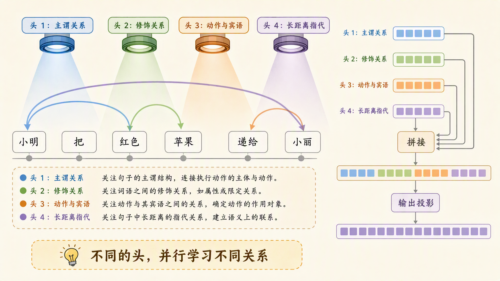

> Qwen3-0.6B 有 16 个查询头，每个头的维度是 128，这些配置在 [Qwen3 技术报告](https://arxiv.org/abs/2505.09388)里都能查到。训练完成后，有的头擅长局部搭配，有的头擅长长距离依赖，各司其职。

### 从 MHA 到 GQA 到 MLA

多头注意力效果好，但推理时要付出一个代价：每个头都有自己独立的 K 和 V。生成时为了不重算历史，所有历史 token 的 K、V 都要存在显存里，这份缓存就是我们常说的 **KV Cache**。头越多、层越深、序列越长，缓存就越大，显存很快吃紧。围绕这个矛盾，注意力头数的设计一路演进：

* **MHA**：Q、K、V 头数相同，比如 16 个头就配 16 组 K、V。质量最好，缓存最大，早期的 GPT-3 就是这个结构。
* **MQA（Multi-Query Attention，多查询注意力）**：2019 年 Shazeer 在 [Fast Transformer Decoding: One Write-Head is All You Need](https://arxiv.org/abs/1911.02150) 里提出，让所有查询头共享同一组 K、V。缓存直接缩小到头数分之一，速度提升明显，但质量有损失。
* **GQA（Grouped-Query Attention，分组查询注意力）**：2023 年 Google 在 [GQA 论文](https://arxiv.org/abs/2305.13245)中提出的折中方案，把查询头分成若干组，每组共享一组 K、V。质量接近 MHA，缓存接近 MQA。LLaMA 3、Qwen3、Mistral 用的都是 GQA。
* **MLA（Multi-head Latent Attention，多头潜在注意力）**：DeepSeek 在 [DeepSeek-V2 论文](https://arxiv.org/abs/2405.04434)中提出的另一条路，不缓存完整的 K、V，而是把它们低秩压缩成一个隐向量存起来，推理时再还原。按论文的数据，DeepSeek-V2 的 KV 缓存比上一代 DeepSeek 67B 减少了 93.3%，效果还不输 MHA。

四种注意力方案的查询头与 K/V 共享关系如下图所示：

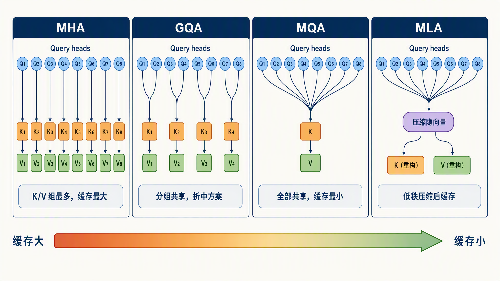

四种方案的取舍可以汇总成一张表：

| 方案 | K/V 组数 | KV 缓存大小 | 代表模型 |
| ---- | ------- | ----------- | ------- |
| MHA | 等于查询头数 | 最大 | GPT-3 |
| GQA | 查询头数的几分之一 | 中等 | LLaMA 3、Qwen3 |
| MQA | 1 | 最小 | Falcon |
| MLA | 压缩成隐向量 | 比 GQA 更省 | DeepSeek-V2/V3 |

这里只需要建立一个印象：注意力头的设计，本质上是在质量和 KV 缓存开销之间做权衡。缓存到底怎么存、怎么管，我们留到下一篇展开。

## 前馈网络

注意力解决 token 之间的信息交换，**前馈网络（Feed-Forward Network，FFN）** 则是对每个 token 的向量单独做加工。注意力算完一轮，每个位置的向量里都揉进了上下文，接下来怎么把这些信息消化成更有用的表示，就是 FFN 要干的事。它的结构比注意力简单得多，我们一层层拆开看。

### 两层 MLP：先放大，再压回

FFN 的结构是两层 **MLP（Multi-Layer Perceptron，多层感知机）**，也就是矩阵乘法叠起来的全连接网络：先把维度放大，中间过一遍激活函数，再压回原来的维度。原始 Transformer 里就是 512 维放大到 2048 维再压回 512 维，Qwen3-0.6B 则是 1024 维放大到 3072 维再压回 1024 维，这个形状从 2017 年一直沿用到今天。

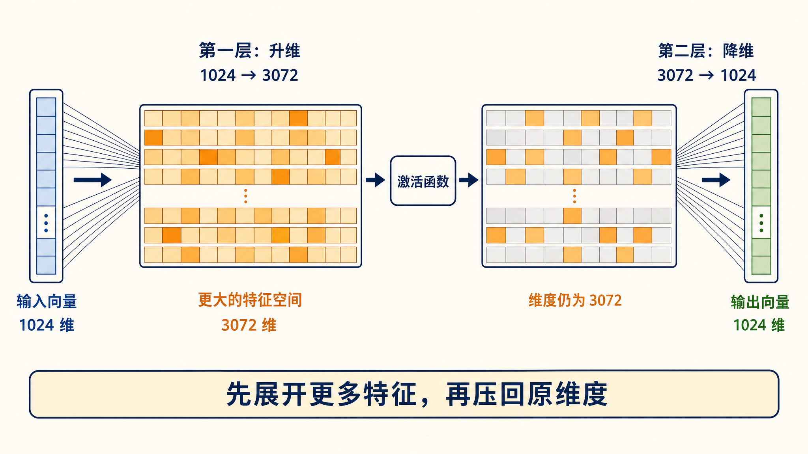

为什么要先放大？一个直觉的解释是：1024 维的向量能容纳的特征有限，放大到 3072 维相当于摊到一张更大的工作台上，模型可以同时检测更多的模式，整理完再装回原来的盒子。

### 激活函数：非线性的来源

正如上一节所说，两层矩阵乘法之间还夹着一步：激活函数。它是逐元素起作用的非线性函数，也是网络能学会复杂模式的关键。如果没有它，两层矩阵乘法叠起来在数学上等价于一层，先放大再压回就失去了意义。

早期的 Transformer 用 **[ReLU（Rectified Linear Unit，线性整流单元）](https://proceedings.mlr.press/v15/glorot11a.html)**，做法很直接：负数归零，正数原样通过。GPT 和 BERT 换成了 **[GELU（Gaussian Error Linear Unit，高斯误差线性单元）](https://arxiv.org/abs/1606.08415)**，形状和 ReLU 类似但处处平滑，负数不再一刀切归零。现在主流模型用的是 **[SiLU（Sigmoid Linear Unit，Sigmoid 线性单元）](https://arxiv.org/abs/1710.05941)**，它还有一个更广为人知的名字，**Swish**，也是同样的思路，公式是 x 乘以 sigmoid(x)，sigmoid 是把任意实数压到 0 和 1 之间的 S 形函数。

用同一组输入对比一下这三个函数：

```python
import torch
import torch.nn.functional as F

x = torch.tensor([-2.0, -0.5, 0.5, 2.0])

print(F.relu(x))
print(F.gelu(x))
print(F.silu(x))
```

输出结果：

```text
tensor([0.0000, 0.0000, 0.5000, 2.0000])
tensor([-0.0455, -0.1543, 0.3457, 1.9545])
tensor([-0.2384, -0.1888, 0.3112, 1.7616])
```

可以看到，ReLU 把负数直接砍成 0，GELU 和 SiLU 则给小负数留了一点非零输出，整条曲线是平滑的。平滑的好处和训练有关：负半区的梯度不至于完全消失，参数更新更稳定。

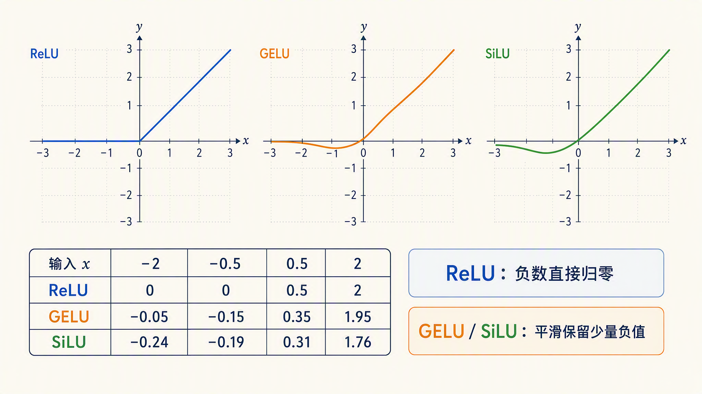

### SwiGLU：给 MLP 加一条门控分支

**SwiGLU** 出自 Shazeer 2020 年的论文 [GLU Variants Improve Transformer](https://arxiv.org/abs/2002.05202)，在 SiLU 的基础上又进了一步。它把 MLP 的放大从一路改成两路：`gate_proj` 和 `up_proj` 都负责把维度放大，gate 一路先过 SiLU 激活，再和 up 一路逐元素相乘，最后由 `down_proj` 压回原维度。

逐元素相乘这一步叫门控，思路来自更早的 GLU 家族：让一路输出充当另一路的开关，控制每个维度放行多少信息。gate 这路过完 SiLU 后，值小的维度会把 up 那路压下去，值大的维度则放行，模型由此学会哪些特征该留下、哪些该抑制。

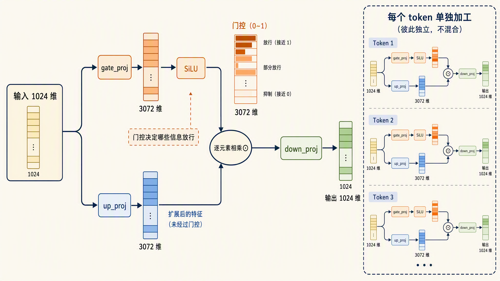

下面用代码模拟一遍这个过程，维度沿用 Qwen3-0.6B 的 1024 和 3072：

```python
import torch
import torch.nn.functional as F

torch.manual_seed(0)
x = torch.randn(1024)          # 一个 token 的输入向量

gate_proj = torch.randn(3072, 1024)
up_proj = torch.randn(3072, 1024)
down_proj = torch.randn(1024, 3072)

gate = x @ gate_proj.T         # 1024 -> 3072
up = x @ up_proj.T             # 1024 -> 3072
hidden = F.silu(gate) * up     # 门控：两路逐元素相乘
out = hidden @ down_proj.T     # 3072 -> 1024

print(gate.shape, hidden.shape, out.shape)
```

输出结果：

```text
torch.Size([3072]) torch.Size([3072]) torch.Size([1024])
```

可以看到，整个 FFN 的全部计算就是三次矩阵乘法加一次逐元素相乘。多了一路矩阵，参数量自然会涨，所以 SwiGLU 的中间维度通常取得比 ReLU 版本小一些，整体参数量和原来保持相当。记住 gate、up、down 这三个名字，等下看真实模型结构时会再遇到。

### FFN 里存的是什么

2020 年特拉维夫大学的一篇论文 [Transformer Feed-Forward Layers Are Key-Value Memories](https://arxiv.org/abs/2012.14913) 认为，FFN 可以看成一个小型的键值记忆库。第一层矩阵的每一行是一个模式探测器，比如识别输入里是否出现了地名加「的首都」这类模式；第二层矩阵的每一列对应一段要往输出里写入的内容，比如把「巴黎」这个方向的表示加进去。一层负责认模式，一层负责写结论，几十层叠起来，模型在预训练时读到的知识就这样存进了 FFN 的权重。

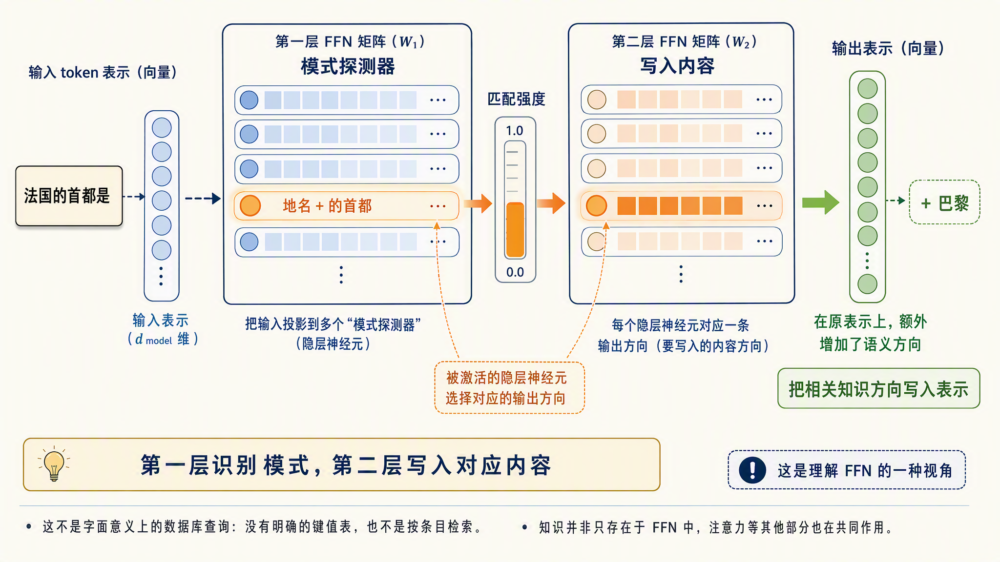

这个视角也解释了为什么 FFN 的参数量比注意力多的多。注意力决定信息往哪流，FFN 才是真正装知识的地方。

### 混合专家：把一个 FFN 换成一排专家

FFN 还有一个重要变体：**混合专家（Mixture of Experts，MoE）**。它把一个大的 FFN 换成一排小的专家 FFN，每个 token 进来后由路由器给所有专家打分，只激活分数最高的几个，其余不参与计算。

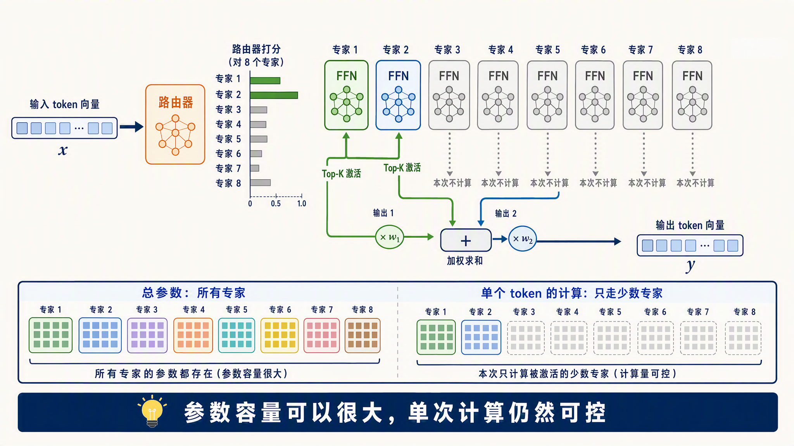

这样做的好处是把参数量和计算量解耦了：总参数做得越大，能装的知识越多，但每个 token 实际消耗的计算只和激活的那几个专家有关。比如 [DeepSeek-V3](https://arxiv.org/abs/2412.19437) 总参数 6710 亿，每个 token 只激活 370 亿；Qwen3 系列的旗舰 Qwen3-235B-A22B 总参数 2350 亿，只激活 220 亿。

MoE 的细节今天不展开，知道它替换的是 Block 里 FFN 那一块就够了。

## 从最后一层到 logits

向量穿过全部 N 层 Block 后，还差两步才能变成下一个 token：

1. 先过最后一次 RMSNorm，把数值分布再稳一遍
2. 再过 **lm_head**，把向量从隐藏维度映射到词表维度，Qwen3 的词表大小是 151936

lm_head 是 language model head 的缩写，直译是语言模型的输出头。它本身只是一个线性层，也就是一个 151936×1024 的矩阵，不带别的计算。输入的 1024 维向量和这个矩阵相乘，相当于拿它分别和矩阵的每一行做点积；矩阵有 151936 行，每行对应词表里的一个 token，算出来的 151936 个点积就是这一轮的输出。

lm_head 的每一行可以理解为对应 token 的代表向量，点积越大，说明隐藏向量和这个 token 越像。模型挑下一个 token 的过程，本质上又是一次匹配打分，和注意力分数的思路一脉相承。

> 既然 lm_head 的每一行是 token 的代表向量，嵌入矩阵的每一行也是，这两份参数能不能干脆共用？Qwen3-0.6B 就是这么做的：它的 lm_head 和嵌入层共享同一个矩阵，这个设计叫**权重绑定（weight tying）**，嵌入矩阵转置一下直接当输出层用，省掉一份 151936×1024 的参数。对小模型来说绑定是常见的做法。

lm_head 的输出叫 **logits（未归一化分数）**：词表里每个候选 token 各得一个分数。分数本身还不是概率，要再过一次 softmax 才变成概率分布。实际生成时，推理框架会按温度、top-p 这些采样策略从分布里挑一个 token，拼到输入末尾，然后开始下一轮前向传播。

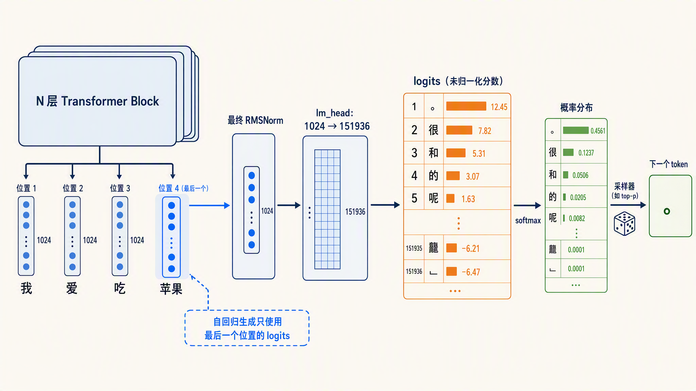

## 再看 Qwen3-0.6B 的完整结构

[Qwen3-0.6B](https://huggingface.co/Qwen/Qwen3-0.6B) 参数量小、结构标准，很适合拿来对照。我们继续以它为例，看看上面讲的各个组件在真实模型中是什么样的。

```python
from transformers import AutoModelForCausalLM

model = AutoModelForCausalLM.from_pretrained("Qwen/Qwen3-0.6B")
print(model)
```

输出如下，每个 Block 的内容相同，这里只展开第一个：

```text
Qwen3ForCausalLM(
  (model): Qwen3Model(
    (embed_tokens): Embedding(151936, 1024)
    (layers): ModuleList(
      (0-27): 28 x Qwen3DecoderLayer(
        (self_attn): Qwen3Attention(
          (q_proj): Linear(in_features=1024, out_features=2048, bias=False)
          (k_proj): Linear(in_features=1024, out_features=1024, bias=False)
          (v_proj): Linear(in_features=1024, out_features=1024, bias=False)
          (o_proj): Linear(in_features=2048, out_features=1024, bias=False)
          (q_norm): Qwen3RMSNorm((128,), eps=1e-06)
          (k_norm): Qwen3RMSNorm((128,), eps=1e-06)
        )
        (mlp): Qwen3MLP(
          (gate_proj): Linear(in_features=1024, out_features=3072, bias=False)
          (up_proj): Linear(in_features=1024, out_features=3072, bias=False)
          (down_proj): Linear(in_features=3072, out_features=1024, bias=False)
          (act_fn): SiLU()
        )
        (input_layernorm): Qwen3RMSNorm((1024,), eps=1e-06)
        (post_attention_layernorm): Qwen3RMSNorm((1024,), eps=1e-06)
      )
    )
    (norm): Qwen3RMSNorm((1024,), eps=1e-06)
    (rotary_emb): Qwen3RotaryEmbedding()
  )
  (lm_head): Linear(in_features=1024, out_features=151936, bias=False)
)
```

对照今天讲的内容，逐行认一下：

* `embed_tokens`：嵌入层，把词表里 151936 个 token 各映射成 1024 维向量，上一篇的主角
* `layers`：28 个 Transformer Block 叠在一起，`(0-27): 28 x` 表示同一结构重复 28 次
* `q_proj / k_proj / v_proj`：Query、Key、Value 的三个投影矩阵
* `q_proj` 输出 2048 而 `k_proj`、`v_proj` 输出 1024：2048 = 16 头 × 128 维，1024 = 8 头 × 128 维。这组数字就是 GQA 的直接证据，16 个查询头配 8 组 K/V
* `o_proj`：多头结果拼接后的输出投影，把 2048 维压回 1024 维
* `q_norm / k_norm`：Qwen3 在 Q 和 K 上额外加的小 RMSNorm，用来稳定训练
* `gate_proj / up_proj / down_proj` 加 `SiLU`：SwiGLU 结构的三件套，中间维度 3072
* `input_layernorm / post_attention_layernorm`：Pre-Norm 结构里的两个 RMSNorm，分别在注意力和 FFN 之前
* `rotary_emb`：RoPE 位置编码的实现，上一篇讲过
* `norm`：所有 Block 走完之后最后一次归一化
* `lm_head`：1024 维到 151936 维的线性映射，输出 logits

再顺手跑一次前向传播，看看 logits 长什么样：

```python
import torch
from transformers import AutoTokenizer

tokenizer = AutoTokenizer.from_pretrained("Qwen/Qwen3-0.6B")
inputs = tokenizer("我爱吃苹果", return_tensors="pt")

with torch.no_grad():
    outputs = model(**inputs)

print(outputs.logits.shape)
```

结果如下：

```
torch.Size([1, 3, 151936])
```

输出形状的最后一维 151936 就是词表大小，中间一维 3 是这次分词得到的 token 数。每个位置都有一份完整的词表分数，但自回归生成只取最后一个位置的 logits 来决定下一个 token，前面位置的结果是顺带算出来的。

> 这里埋个彩蛋：这些被扔掉的分数并不是废品。后面讲到推理加速的时候，会有一项技术专门把它们捡起来当验收标准用，一次前向就能验好几个 token，到时候记得回来看这一行。

## 小结

今天我们把一个向量序列从嵌入层到 logits 的完整旅程走完了：

1. **Transformer Block 结构**：现代 Block 从原始 Transformer 的解码器演化而来，拿掉了交叉注意力，剩下注意力和前馈网络两段。骨架上有三个关键设计：残差连接给信息和梯度留了一条直通旁路，深层网络才训得动；RMSNorm 按均方根做等比缩放，把数值拉回稳定范围；Pre-Norm 把归一化放在子层之前，让残差旁路畅通。主流模型的 Block 都是这套组合，整个模型就是几十个 Block 叠起来
2. **注意力机制**：每个 token 通过三个投影矩阵得到 Query、Key、Value，Q 和 K 的点积给出 token 之间的注意力分数，再按分数对所有 token 的 Value 加权求和，token 之间的信息交换就完成了
3. **因果掩码**：分数矩阵上三角置为负无穷，保证每个位置只能看到自己和左边的 token，训练和生成行为一致
4. **注意力头的演进**：MHA 到 MQA 到 GQA 再到 DeepSeek 的 MLA，一路都在压缩 KV 缓存，用更小的显存换尽量不掉的质量
5. **FFN 与 SwiGLU**：对每个 token 单独加工的两层 MLP，先放大再压回，中间靠激活函数引入非线性；现在主流用带门控的 SwiGLU。FFN 占了模型约三分之二的参数，可以解读成模型的键值记忆库；MoE 版本把参数和计算解耦，每次只激活部分专家，DeepSeek、Qwen 的大模型都在用
6. **logits**：最后一层出来后再过 RMSNorm 和 lm_head。lm_head 本质是一个词表大小的矩阵，每行是一个 token 的代表向量，输出就是隐藏向量和每个 token 的匹配分数，下一个 token 从这些分数里采出来

不过这里藏着一个小问题。今天我们一直在描述一遍前向传播，但生成是逐 token 进行的：每生成一个新 token，都要把变长了一位的整段序列重新送进模型。如果每一步都把历史 token 的 K、V 从头重算一遍，序列越长算得越慢，而且绝大部分计算是完全重复的。这个浪费怎么消除，就是下一篇的主角 **KV Cache**。我们明天继续。

## 参考

* [Deep Residual Learning for Image Recognition（ResNet 论文）](https://arxiv.org/abs/1512.03385)
* [Root Mean Square Layer Normalization（RMSNorm 论文）](https://arxiv.org/abs/1910.07467)
* [Layer Normalization（LayerNorm 论文）](https://arxiv.org/abs/1607.06450)
* [On Layer Normalization in the Transformer Architecture（Pre-Norm 分析）](https://arxiv.org/abs/2002.04745)
* [Attention Is All You Need（Transformer 原始论文）](https://arxiv.org/abs/1706.03762)
* [Qwen3 技术报告](https://arxiv.org/abs/2505.09388)
* [Fast Transformer Decoding: One Write-Head is All You Need（MQA 论文）](https://arxiv.org/abs/1911.02150)
* [GQA: Training Generalized Multi-Query Transformer Models](https://arxiv.org/abs/2305.13245)
* [DeepSeek-V2 论文（MLA 出处）](https://arxiv.org/abs/2405.04434)
* [Deep Sparse Rectifier Neural Networks（ReLU 推广到深层网络）](https://proceedings.mlr.press/v15/glorot11a.html)
* [Gaussian Error Linear Units（GELU 论文）](https://arxiv.org/abs/1606.08415)
* [Searching for Activation Functions（SiLU/Swish 论文）](https://arxiv.org/abs/1710.05941)
* [GLU Variants Improve Transformer（SwiGLU 出处）](https://arxiv.org/abs/2002.05202)
* [Transformer Feed-Forward Layers Are Key-Value Memories（FFN 键值记忆解读）](https://arxiv.org/abs/2012.14913)
* [DeepSeek-V3 技术报告](https://arxiv.org/abs/2412.19437)
* [Qwen3-0.6B Hugging Face 模型页](https://huggingface.co/Qwen/Qwen3-0.6B)
