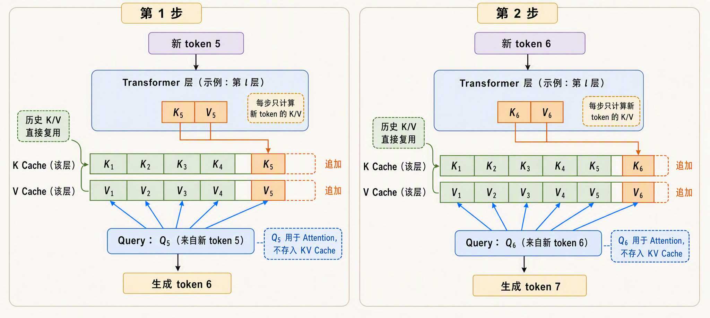
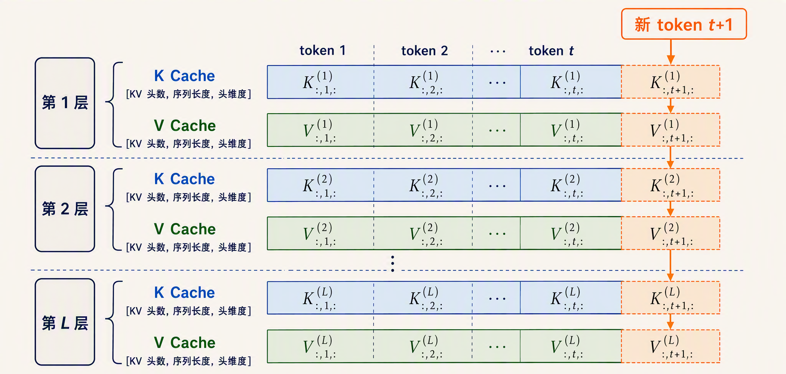
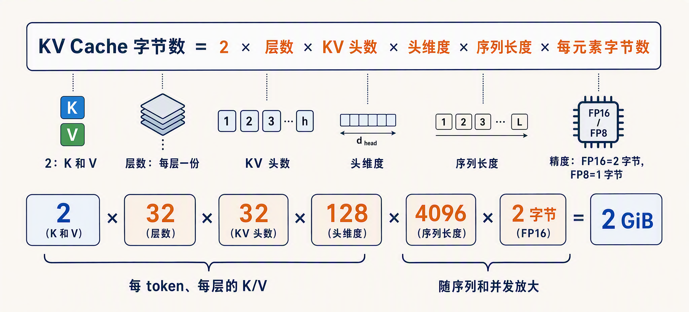
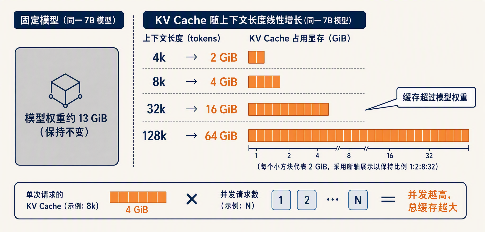
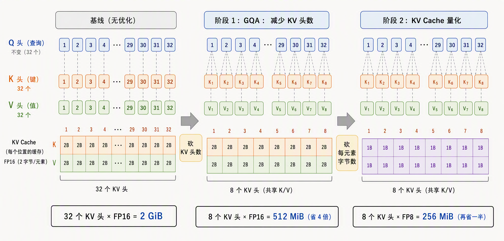
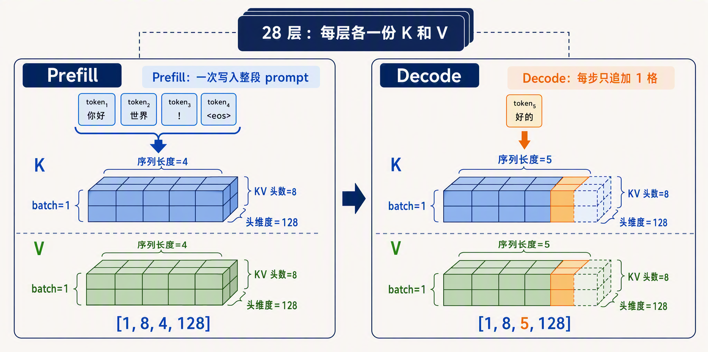

# 学习大模型推理的 KV Cache

在上一篇中，我们把一次前向传播完整走了一遍：token 先查表变成向量，然后逐层经过 Transformer Block，每层里用 Q、K、V 三个向量做自注意力，最后从词表分布里挑出下一个 token。我们也知道了生成是**自回归（Autoregressive）**的，也就是一个 token 一个 token 地依次生成，每生成一个新 token 都要跑一次前向。

上一篇的结尾我们留了一个问题：生成第 t 个 token 时，注意力需要用到前 t-1 个 token 的 K 和 V，而这些 K、V 在前面的步骤里其实已经算过了，值也不会变。如果每一步都把整段序列重新跑一遍前向，这些历史 K、V 就被白白重算了无数遍。今天我们就来解决这个问题，主角是大模型推理里最重要的一项优化：**KV Cache（键值缓存）**，也就是把每层每个 token 的 K、V 向量缓存起来，避免重复计算。

## 从重复计算说起

我们再回忆一下注意力计算的过程：每个 token 的向量经过三个投影矩阵，得到 Query、Key、Value 三个向量。位置 i 的 token 要和它前面的所有位置做注意力，方式是用自己的 Query 去和每个位置的 Key 算相似度，再对 Value 加权求和。

关键在于，有了上一篇讲的因果掩码，位置 i 的表示只由它自己和它前面的 token 决定，后面生成什么内容都影响不到它。所以一个 token 的 K、V 一旦算出来，就是永远不变的常量。

假设 prompt 有 10 个 token，要生成 100 个新 token，每一步的做法是把目前已经有的全部 token 重新送进模型：

* 第 1 步：输入 10 个 token，算出第 11 个
* 第 2 步：输入 11 个 token，算出第 12 个
* 第 3 步：输入 12 个 token，算出第 13 个
* ……

第 2 步重算了前 10 个 token 的 K、V，第 3 步又重算了前 11 个。越到后面，每一步重算的量越大。生成 n 个 token，总的计算量大体是 1 + 2 + … + n 的累加，也就是 **O(n²)** 的复杂度。序列一长，这些重复计算就成了推理速度的主要瓶颈。

## KV Cache 工作原理

既然历史 token 的 K、V 是不变的，办法就很直接了：算过一次就存下来，后面每一步直接用。

具体来说，每跑一步前向时，把每一层算出的 K、V 向量按 token 顺序追加到一块缓存里。下一步只需要把**新生成的这一个 token** 送进模型：它经过每一层时，算出自己新的 K、V 追加进缓存，再用自己的 Q 去和缓存里已有的全部 K、V 做注意力。历史 token 的 K、V 一次都不用重算。

逐 token 生成的循环里，缓存的追加过程如下图所示：



有了这个缓存，每一步前向只处理 1 个新 token，生成 n 个 token 的总计算量从 O(n²) 降到了 **O(n)**。序列越长，省得越多，这也是长文本生成能跑得动的前提。

> 注意缓存是**每一层各有一份**的。模型有 L 层，就有 L 份 K 缓存和 L 份 V 缓存，每层缓存里按序列顺序存着所有历史 token 在该层的 K、V 向量。

缓存的整体结构如下图所示，每一层都维护着一份随序列增长的 K、V 矩阵：



可以把这个机制想象成一本笔记本：模型每读一个 token，就在每一层对应的页上记下它的 K、V，后面再提到它时直接翻笔记，不用重新理解一遍。

缓存与不缓存的对比如下：

| 对比项 | 不用 KV Cache | 用 KV Cache |
| ---- | ---- | ---- |
| 每步前向输入 | 全部历史 token | 仅 1 个新 token |
| 历史 K/V | 每步重算 | 从缓存直接读 |
| 生成 n 个 token 的总计算量 | O(n²) | O(n) |
| 额外显存开销 | 无 | 随序列长度线性增长 |

可以看到，天下没有免费的午餐，计算量省下来了，代价是多了一块不断增长的显存占用。这是典型的**以空间换时间**。

## KV Cache 显存占用

KV Cache 的大小可以精确推导。每个 token 在每一层要存一个 K 向量和一个 V 向量，每个向量的大小是 KV 头数乘上头维度。把各部分乘起来，一个请求的 KV Cache 占用为：

```text
KV Cache 字节数 = 2 × 层数 × KV 头数 × 头维度 × 序列长度 × 每元素字节数
```

我们逐项解释下：

* **2**：K 和 V 各存一份
* **层数**：每层都有独立的缓存
* **KV 头数 × 头维度**：一个 K 或 V 向量的元素个数，比如 32 个头、每头 128 维，就是 4096 个元素
* **序列长度**：prompt 长度加上已生成的 token 数，缓存随它线性增长
* **每元素字节数**：由存储精度决定，FP16（16 位浮点）是 2 字节，FP8 是 1 字节

拿一个 7B 模型为例，32 层、32 个 KV 头、128 头维度、FP16 精度，跑 4096 的上下文，显存占用为：

```text
2 × 32 × 32 × 128 × 4096 × 2 字节 = 2147483648 字节 = 2 GiB
```



一个请求，光 KV Cache 就要 **2 GiB**。这个数是什么概念？7B 模型 FP16 的权重本身大约是 13 GiB，也就是说一条 4k 序列的缓存相当于模型权重的七分之一。

缓存随序列长度线性增长，把几个常见上下文长度都代入公式，同一个模型的显存占用是这样的：

| 上下文长度 | 单请求 KV Cache | 相当于模型权重（约 13 GiB） |
| ---- | ---- | ---- |
| 4k | 2 GiB | 约 1/7 |
| 8k | 4 GiB | 约 2/7 |
| 32k | 16 GiB | 超过权重本身 |
| 128k | 64 GiB | 近 5 倍权重 |

32k 上下文时缓存已经比模型权重还大，128k 时是权重的好几倍。

不仅如此，还有两个放大因素。一是这个公式是**单个请求**的账，服务端同时处理多少个并发请求，缓存总量就乘多少。二是序列长度在生成过程中一直涨，prompt 4k 不代表缓存停在 4k 对应的大小，生成的每个 token 都在往里追加。

下面这张图直观地画出了缓存随上下文长度的增长：



现在可以理解为什么长上下文的服务成本高了。上下文窗口从 4k 扩到 128k，模型本身没变，但每个请求的 KV Cache 膨胀了 32 倍。显存就那么多，缓存吃得越多，能同时容纳的并发请求就越少，服务的吞吐和成本都直接受影响。KV Cache 也因此成了推理时显存占用的大头。

## 给 KV Cache 瘦身

既然显存紧张，自然就有人想办法压缩 KV Cache。看公式的各个因子，有两条路最直接。

第一条是砍 **KV 头数**，这就是上一篇讲过的 **GQA（Grouped-Query Attention，分组查询注意力）**。标准的多头注意力里每个 Q 头配一个独立的 KV 头，GQA 让多个 Q 头共享一组 K、V，KV 头数就降下来了。还是上面那个 7B 模型，如果把 KV 头数从 32 砍到 8，其他不变，KV Cache 直接省 **4 倍**，4k 上下文从 2 GiB 降到 512 MiB。这也是现在主流开源模型（Llama 3、Qwen3、Gemma 等）几乎清一色用 GQA 的原因，它用很小的效果损失换来缓存的大幅缩水。GQA 出自 Google 2023 年的 [GQA 论文](https://arxiv.org/abs/2305.13245)，感兴趣的同学可以翻一翻。

第二条是砍 **每元素字节数**，也就是给 KV Cache 做量化。权重可以量化，缓存同样可以：从 FP16 降到 FP8 或 INT8，每个元素从 2 字节变 1 字节，缓存再省一半。两条路叠加，32 头变 8 头再乘上 FP8，缓存能压到原来的八分之一。[transformers 的官方文档](https://huggingface.co/docs/transformers/main/en/kv_cache)里就有量化缓存（Quantized Cache）的用法，[vLLM](https://github.com/vllm-project/vllm) 也支持 FP8 的 KV Cache。



> 除了这两条路，还有滑动窗口（只保留最近的一段缓存）、跨层共享缓存等更激进的方案，核心思想都一样：缓存里的信息有冗余，不必全量精确保留。

## 实战 KV Cache

概念讲完，我们亲手跑一下，看看缓存长什么样。用 Hugging Face [transformers](https://github.com/huggingface/transformers) 加载一个小模型 [Qwen3-0.6B](https://huggingface.co/Qwen/Qwen3-0.6B)，它的配置是 28 层、8 个 KV 头、128 头维度，正好是个 GQA 模型。

transformers 的前向接口有个 `use_cache` 参数，打开后模型的输出里会带上 `past_key_values`，这就是 KV Cache。新版 transformers 把它封装成了 `DynamicCache` 对象，第 i 层的 K、V 分别通过 `layers[i].keys` 和 `layers[i].values` 访问。我们先对 prompt 做一次完整前向，再拿生成的新 token 做一次增量前向，对比两次缓存的形状：

```python
import torch
from transformers import AutoModelForCausalLM, AutoTokenizer

model_id = "Qwen/Qwen3-0.6B"
tokenizer = AutoTokenizer.from_pretrained(model_id)
model = AutoModelForCausalLM.from_pretrained(model_id, dtype="auto")

prompt = "The quick brown fox"
inputs = tokenizer(prompt, return_tensors="pt").to(model.device)

# 第一次前向：处理完整 prompt
with torch.no_grad():
    out1 = model(**inputs, use_cache=True)
past1 = out1.past_key_values
print("缓存层数:", len(past1))
print("第 0 层 K 形状:", past1.layers[0].keys.shape)
print("第 0 层 V 形状:", past1.layers[0].values.shape)

# 第二次前向：只输入新 token，带上已有缓存
next_token = torch.argmax(out1.logits[0, -1, :]).reshape(1, 1)
with torch.no_grad():
    out2 = model(next_token, past_key_values=past1, use_cache=True)
past2 = out2.past_key_values
print("第二次前向后第 0 层 K 形状:", past2.layers[0].keys.shape)
print("第二次前向后第 0 层 V 形状:", past2.layers[0].values.shape)
```

运行结果如下：

```text
缓存层数: 28
第 0 层 K 形状: torch.Size([1, 8, 4, 128])
第 0 层 V 形状: torch.Size([1, 8, 4, 128])
第二次前向后第 0 层 K 形状: torch.Size([1, 8, 5, 128])
第二次前向后第 0 层 V 形状: torch.Size([1, 8, 5, 128])
```

可以看到几个和理论完全对应的点：

1. **缓存有 28 份**：和模型的层数一致，每层独立存自己的 K、V
2. **每层形状是 [batch, KV 头数, 序列长度, 头维度]**：Qwen3-0.6B 是 8 个 KV 头、128 头维度，prompt 切成了 4 个 token，所以是 [1, 8, 4, 128]
3. **第二次前向只输入了 1 个 token**，但缓存从 4 涨到了 5：新 token 的 K、V 被追加到了历史缓存后面，注意力是在完整的 5 个 token 上算的

对照前面的显存公式，Qwen3-0.6B 每个 token 的缓存是 2 × 28 × 8 × 128 × 2 字节，约 112 KB，4k 上下文大约 448 MiB。

细心的读者会注意到，第一次前向和第二次前向有个明显的不对称：第一次一次性处理了 prompt 的全部 4 个 token，往缓存里写了 4 份 K、V；第二次只处理 1 个 token，缓存只涨了 1 格。这正是第一篇讲过的 Prefill 和 Decode 两个阶段：Prefill 一次性吃完整段 prompt、顺手填满缓存，Decode 每步只处理一个新 token、并往缓存里追加一格。



> 如果想更贴近底层地看这个机制，Sebastian Raschka 写过一篇 [Understanding and Coding the KV Cache in LLMs](https://magazine.sebastianraschka.com/p/coding-the-kv-cache-in-llms)，不用框架封装，从零手写了一个带 KV Cache 的生成循环，感兴趣的同学可以看看。

## 小结

今天我们学习了大模型推理中至关重要的 KV Cache 机制：

1. **问题**：自回归生成时，历史 token 的 K、V 是不变的常量，朴素做法每步重算整段序列，总计算量 O(n²)
2. **KV Cache 的思想**：每层缓存所有历史 token 的 K、V，每步只为新 token 算一次并追加，总计算量降到 O(n)，是典型的以空间换时间
3. **显存占用**：缓存大小 = 2 × 层数 × KV 头数 × 头维度 × 序列长度 × 每元素字节数。一个 7B 模型跑 4k 上下文，单请求约 2 GiB，32k 就是 16 GiB，长上下文和并发都会放大这块开销
4. **瘦身手段**：GQA 砍 KV 头数，量化砍每元素字节数，两者可以叠加
5. **动手验证**：transformers 里 `use_cache=True` 会返回 `past_key_values`，形状为 [batch, KV 头数, 序列长度, 头维度]，随生成步数逐 token 增长

KV Cache 解决了计算重复的问题，但它自己成了显存大户。一个自然的问题是：既然每一步的缓存用量差别这么大，prefill 阶段一次性写入几千个 token 的 K、V，decode 阶段一步只写一个，这两个阶段的特征是不是应该分开对待？推理系统正是这么做的，这就是 Prefill 与 Decode 两个阶段的划分。我们明天继续。

## 参考

* [GQA 论文：Training Generalized Multi-Query Transformer Models](https://arxiv.org/abs/2305.13245)
* [Sebastian Raschka：从零实现 KV Cache](https://magazine.sebastianraschka.com/p/coding-the-kv-cache-in-llms)
* [Hugging Face transformers 官方文档：Cache strategies](https://huggingface.co/docs/transformers/main/en/kv_cache)
* [vLLM GitHub 仓库](https://github.com/vllm-project/vllm)
* [Hugging Face transformers GitHub 仓库](https://github.com/huggingface/transformers)
* [Qwen3-0.6B 模型页面](https://huggingface.co/Qwen/Qwen3-0.6B)
