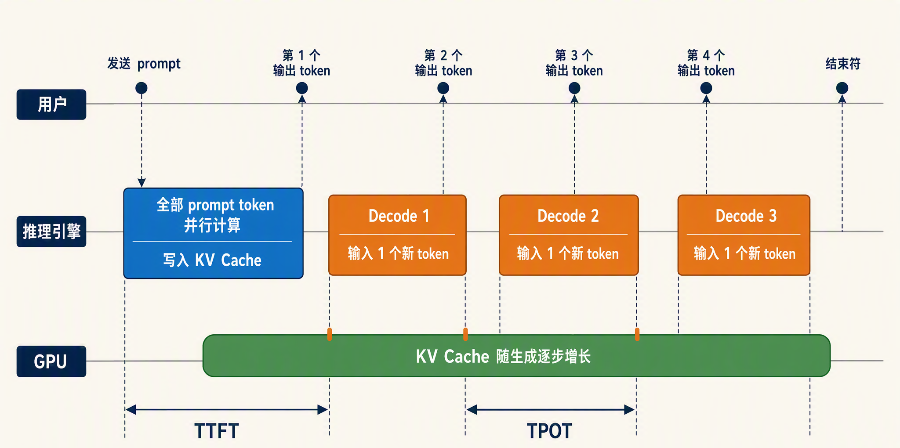
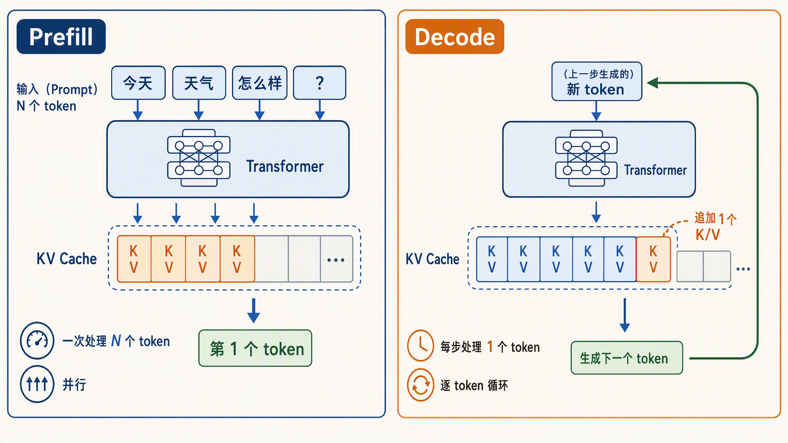
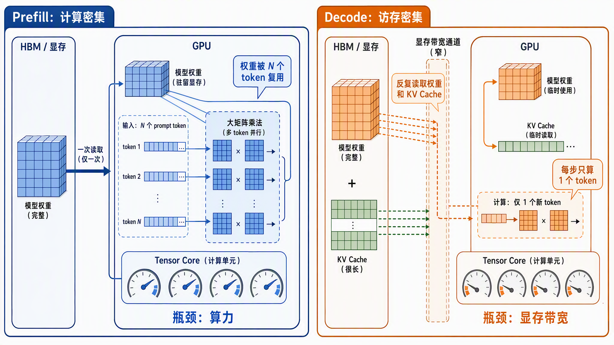
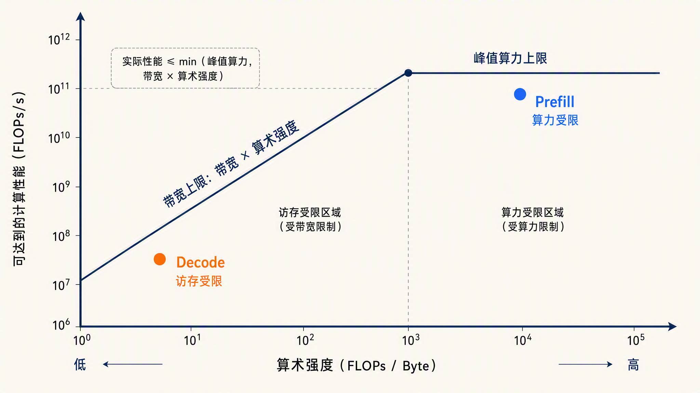
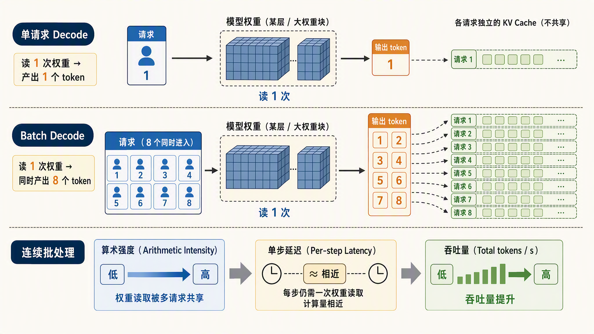
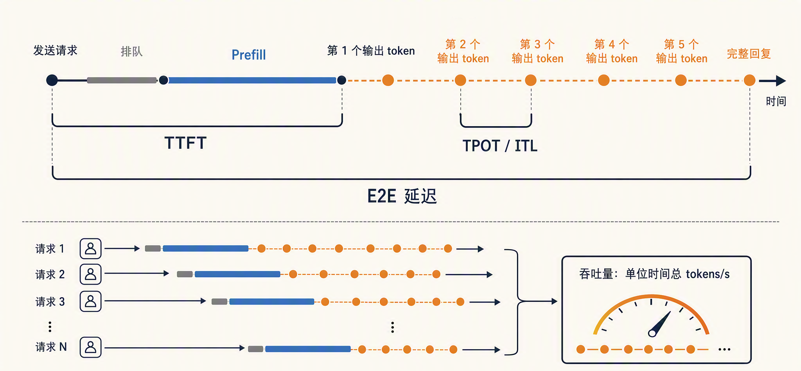
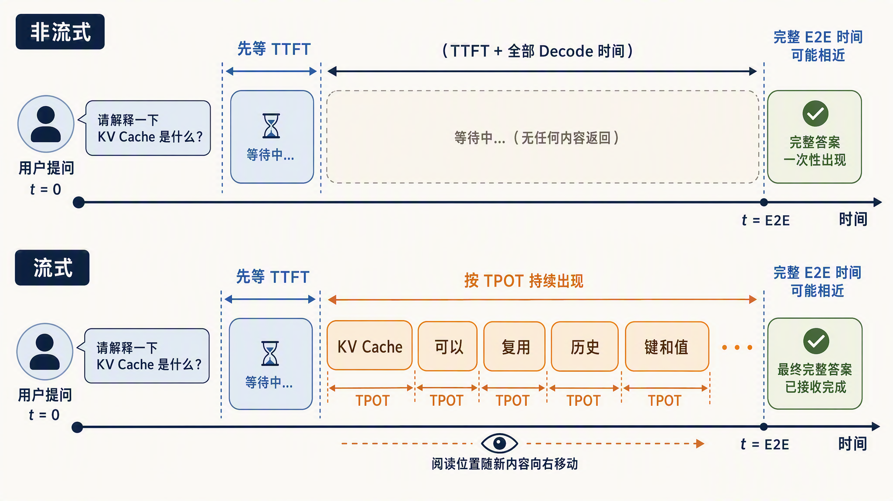
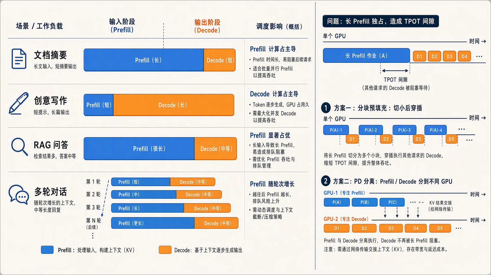

# 学习大模型推理的两个阶段：Prefill 与 Decode

在上一篇中，我们学习了 KV Cache：推理时把历史 token 的 Key 和 Value 缓存下来，每一步生成都不用重算整段上下文，正是它让逐 token 的自回归生成在工程上变得可行。当时我们留了一个视角没有展开：这份缓存不是一次性建好的，也不是一次性用完的。它先被整段 prompt 一次性填满，然后在生成过程中被逐 token 消耗、逐 token 追加。

这个先填充、后消耗的节奏，恰好对应第一篇提到的两个阶段：**Prefill（预填充）** 和 **Decode（解码）**。可以说，推理领域绝大多数的性能讨论，最后都会落到这两个阶段的差异上。今天我们就来学习这两个阶段，顺便认识 TTFT、TPOT 这几个衡量推理性能的核心指标。

## 一次推理的两个阶段

第一篇概览里我们已经见过这两个阶段，这里快速回顾一下。一次请求从进来到出完，走的是下面这条路：

1. **Prefill 阶段**：把 prompt 的所有 token 一次性并行送进模型，跑一遍完整的前向计算。这一步会把 KV Cache 填满，同时产出第一个输出 token
2. **Decode 阶段**：进入循环。每一步只把上一步新生成的那个 token 送进模型，结合已有的 KV Cache 算出下一个 token，再把它的 KV 追加进缓存。循环一直持续到模型产出结束符，或者达到设定的长度上限

用时序图把整个过程画出来：



可以看到，两个阶段的分工很清楚：prefill 一次处理 N 个 token，decode 每步只处理 1 个 token。这个数量差异看起来只是形式上的不同，实际上决定了它们在硬件上的瓶颈完全不同。下面这张图把两个阶段的工作模式画得更直观一些：



### Prefill：计算密集

先看 prefill。prompt 里的所有 token 是同时过模型的，注意力计算覆盖整个序列，矩阵乘法的形状是 `N × d` 乘 `d × d` 这种大块头。N 是 prompt 的 token 数，d 是每个 token 向量的维度，N 越大，每个计算单元分到的活越多，GPU 的 **Tensor Core** 基本处于打满状态。

> [Tensor Core（张量核心）](https://www.nvidia.com/en-us/data-center/tensor-cores/)是 NVIDIA GPU 里专门做矩阵乘法的硬件单元，2017 年随 Volta 架构首次引入。普通的 CUDA 核心一次只能算一个乘加，Tensor Core 一条指令就能完成一小块矩阵的乘加运算（D = A × B + C），吞吐高出一个数量级。它还原生支持 FP16、BF16、FP8 这些低精度格式，大模型的训练和推理能跑得快，靠的就是它。

这种负载叫**计算密集型（compute-bound）**：瓶颈在算力，不在数据搬运。显存里的权重读一次，能被 N 个 token 的计算反复复用，数据搬运的成本被摊薄了。所以对 prefill 来说，GPU 的峰值算力（FLOPS）是决定性因素，prompt 越长，prefill 的耗时越长。而且注意力计算随序列长度近似平方增长，所以长上下文场景里 prefill 的开销涨得比我们想象的更快。

另外 prefill 是 KV Cache 的写入方。prompt 每个位置算出来的 Key 和 Value 都会存进缓存，供后面 decode 阶段反复读取。

## Decode：访存密集

再看 decode，情况完全反过来。

每一步只处理 1 个新 token，但模型前向计算所需的权重一个都不能少。也就是说，每生成一个 token，都要把整套模型权重和截止到目前的全部 KV Cache 从显存里读一遍，而真正做的计算只有一个 token 的量。读进来几十上百 GB 的数据，只为一丁点计算服务。

这种负载叫**访存密集型（memory-bound）**：瓶颈在显存带宽，也就是数据搬运的速度，不在算力。计算单元大部分时间在等数据，大量闲置。这也解释了一个常见现象：单请求跑 decode 时去看 GPU 利用率，数字往往很低。这不是 GPU 没干活，而是它的大部分时间花在等显存送数据上。



## 算术强度与 Roofline 模型

两个阶段的差异可以用一个指标统一描述：**算术强度（Arithmetic Intensity）**，即每读一个字节的数据能做多少次浮点运算。

* **Prefill 的算术强度高**：权重读一次，被几百上千个 token 复用，FLOPs 与字节数的比值很大，落在算力瓶颈区
* **Decode 的算术强度低**：每步只为 1 个 token 计算，却要读全部权重和 KV Cache，FLOPs 与字节数的比值很小，落在带宽瓶颈区

这套分析方法来自**屋顶线模型（Roofline Model）**，是 Williams、Waterman 和 Patterson 在 2009 年提出的性能分析框架。它的核心思想是：一个程序的实际性能，取峰值算力和带宽乘以算术强度两者中的较小者，算术强度决定了程序落在哪个瓶颈区。公式的细节我们这里不展开，感兴趣的话可以读这篇用 Roofline 模型逐层分析 LLM 推理的综述：

* https://arxiv.org/html/2402.16363v4

用一张简化的 Roofline 图表示两个阶段所处的瓶颈区域：



## 针对两个阶段的优化方案

知道了两个阶段的瓶颈在哪，优化的方向就清楚了，大体可以归成两类。

Prefill 是计算密集型，优化围绕省算力展开：**前缀缓存**让多个请求共享的 prompt 前缀只算一次，不用每个请求都重复 prefill；**分块预填充**把超长 prompt 切成小块分批算，避免一个长请求把其他人堵住。

Decode 是访存密集型，优化围绕省搬运展开：**量化**把每个权重和缓存元素占的字节数压小；**投机解码**让一次前向多产出几个 token；**多卡张量并行**把权重切开分到多张卡上，各读各的；**批处理**把多个请求拼在一起跑，同一份权重读一遍，服务多个请求。

这些手段后面有机会单独开篇细讲，这里用 Roofline 的分析方法重点看一下批处理。

回到 Roofline 的式子：性能取峰值算力和「带宽 × 算术强度」的较小者。prefill 在算力瓶颈区，拼批处理收益有限。而 decode 卡在带宽这一项上，要提速就得把算术强度推高，批处理的做法正是如此：N 条请求拼在一步里过模型，计算量涨 N 倍，权重却只读一遍，FLOPs 与字节数的比值就高了 N 倍。只要批处理还没大到把 decode 推过 Roofline 的拐点，吞吐量就随批处理大小近似线性增长，而每步的耗时几乎不变。

因此 decode 阶段单跑一条请求是在浪费带宽，把几十上百条请求一起跑，显存带宽的利用率才算真正提上来。



## 核心性能指标

有了两个阶段的划分，推理系统的核心指标就很好理解了。我们逐个定义。

**TTFT（Time To First Token，首 token 延迟）**：从请求发出到收到第一个输出 token 的时间。它由排队时间和 prefill 耗时共同决定，prompt 越长，prefill 越慢，TTFT 越大。

**TPOT（Time Per Output Token，每个输出 token 的平均耗时）**：decode 阶段生成相邻两个 token 的平均间隔。它由 decode 的每步耗时决定，反映的是生成过程的快慢。还有一个等价指标 **ITL（Inter-Token Latency，相邻 token 间隔）**，不同基准工具对它的统计口径略有差别，有的把第一个 token 算进去，有的不算，所以跨工具对比数字时要看清定义。NVIDIA 的 [NIM 基准文档](https://docs.nvidia.com/nim/benchmarking/llm/latest/metrics.html)里给了一个常见口径：ITL 等于端到端延迟减去 TTFT，再除以输出 token 数减一，这样就把 prefill 的影响剔掉了。

**端到端延迟（End-to-End Latency，E2E 延迟）**：从请求发出到拿到完整回复的总时间。它近似等于 TTFT 加上 TPOT 乘以输出 token 数，是前两者叠加的结果。

**吞吐量（Throughput）**：系统单位时间产出的 token 总数，通常写作 tokens/s。和延迟是同一个硬币的两面：单请求时延迟低不代表并发时吞吐高，连续批处理这类调度手段就是为了在延迟可接受的前提下把吞吐拉上去。

这四个指标里，TTFT 和 TPOT 是最重要的两个，因为它们分别挂在两个阶段上，定位性能问题时能直接看出瓶颈在哪个阶段。



## 实战 TTFT 和 TPOT

下面我们通过一个简单的示例来体验下这两个指标，用 Hugging Face Transformers 加载 [Qwen3-0.6B](https://huggingface.co/Qwen/Qwen3-0.6B) 这个小模型，配合 `TextIteratorStreamer` 做流式生成，记录每个 token 到达的时间：

```python
import time
from threading import Thread
from transformers import AutoModelForCausalLM, AutoTokenizer, TextIteratorStreamer

model_id = "Qwen/Qwen3-0.6B"
tokenizer = AutoTokenizer.from_pretrained(model_id)
model = AutoModelForCausalLM.from_pretrained(model_id)

prompt = "用三句话解释什么是 KV Cache"
inputs = tokenizer(prompt, return_tensors="pt").to(model.device)

# 流式输出器：每生成一段文本就吐出来一段，而不是等全部生成完
streamer = TextIteratorStreamer(tokenizer, skip_prompt=True, skip_special_tokens=True)

start = time.perf_counter()
thread = Thread(
    target=model.generate,
    kwargs={**inputs, "streamer": streamer, "max_new_tokens": 128},
)
thread.start()

ttft = None
arrival_times = []
for chunk in streamer:
    now = time.perf_counter()
    if ttft is None:
        ttft = now - start  # 第一段文本到达，就是 TTFT
    arrival_times.append(now)
thread.join()

tpot = (arrival_times[-1] - arrival_times[0]) / max(len(arrival_times) - 1, 1)
print(f"TTFT: {ttft * 1000:.1f} ms")
print(f"TPOT: {tpot * 1000:.1f} ms")
print(f"总耗时: {(arrival_times[-1] - start) * 1000:.1f} ms")
```

我的这台 Mac 上跑出来的结果如下：

```text
TTFT: 2112.7 ms
TPOT: 42.4 ms
总耗时: 7543.8 ms
```

这里有几个点可以展开介绍一下：

1. `generate()` 是阻塞调用，所以要放到单独的线程里跑，主线程从 streamer 里逐段取结果
2. `TextIteratorStreamer` 吐出的是解码后的文本片段，不严格等于单个 token。如果要精确到 token 级，可以继承 `BaseStreamer` 重写 `put()` 方法，一般来说没这个必要
3. 第一次调用包含模型加载后的预热开销，正式测量前建议先跑一次热身

从最终的输出结果可以看到，第一个数字明显大于后面的平均值，这正是两个阶段的直接体现：TTFT 里装着整个 prefill，自然比 decode 单步慢。具体的毫秒数和机器强相关，在不同设备上差异很大，但 TTFT 大于 TPOT 这个关系是稳定的。

## 流式输出

理解了这两个指标，流式输出的动机就很清楚了。

如果不用流式，用户要等完整的 E2E 延迟才能看到任何内容。回复越长，白屏时间越久。用了**[流式输出（Streaming）](https://huggingface.co/docs/transformers/main/en/generation_strategies#streaming)**，用户只需要熬过一个 TTFT 就能看到第一个字，之后内容以 TPOT 的节奏逐个出现。只要生成的速度比人阅读的速度快，体感就是流畅的，哪怕整段回复实际要生成很久。



所以面向聊天的产品，优化的第一优先级通常是 TTFT。它决定了用户觉得模型快不快。而长文生成场景下，TPOT 决定了阅读是否跟得上：如果 TPOT 太慢，用户读完上一句还得干等下一句，阅读节奏照样被打断。

## 不同负载的两阶段配比

最后看一个工程上更现实的问题：不同业务里，prefill 和 decode 的比例差得很远。

| 负载类型 | 输入 | 输出 | 两阶段特征 | 优化重点 |
| ---- | ---- | ---- | ---- | ---- |
| 文档摘要 | 长 | 短 | 长 prefill，短 decode | 压低 TTFT |
| 创意写作 | 短 | 长 | 短 prefill，长 decode | 压低 TPOT |
| RAG 问答 | 超长 | 中等 | 超长 prefill，KV Cache 占用大 | 前缀缓存、TTFT |
| 多轮对话 | 逐轮变长 | 中等 | prefill 随轮数增长 | 前缀缓存 |



既然两个阶段吃完全不同的硬件资源，把它们硬塞在同一张卡上就会互相干扰：一个长 prefill 插进来，正在 decode 的请求 TPOT 就会被顶高，输出节奏突然卡一下。工程上有两类解法。一类是把 prefill 切成小块和 decode 穿插着跑，Sarathi-Serve 的**分块预填充（chunked prefill）** 走的就是这条路；另一类更彻底，直接把两个阶段拆到不同的机器上，各配各的硬件，这就是 **PD 分离（Prefill-Decode Disaggregation）**，OSDI 2024 上发表的 [DistServe](https://arxiv.org/abs/2401.09670) 是这条路线的代表作，近两年各家推理框架都在往这个方向走。这块内容我们后面单开一篇细讲，今天就先学到这里。

## 小结

今天我们学习了一次推理的两个阶段：

1. **两个阶段**：prefill 把 prompt 的所有 token 并行过一遍模型，填满 KV Cache 并产出第一个 token；decode 每步只处理 1 个新 token，循环生成直到结束
2. **两种瓶颈**：prefill 是计算密集型，吃 GPU 算力；decode 是访存密集型，每步都要把全部权重和 KV Cache 读一遍，算力大量闲置，这也是 decode 阶段 GPU 利用率低的原因
3. **一个统一视角**：算术强度。prefill 算术强度高，落在 Roofline 的算力瓶颈区；decode 算术强度低，落在带宽瓶颈区
4. **优化方案**：prefill 省算力，靠前缀缓存、分块预填充；decode 省搬运，靠量化、投机解码、张量并行和批处理。其中批处理对 decode 收益最大，N 条请求拼在一步里，权重只读一遍，算术强度翻 N 倍，这是推理服务追求高并发连续批处理的原因
5. **四个指标**：TTFT 由 prefill 决定，TPOT 和 ITL 由 decode 决定，E2E 延迟是两者叠加，吞吐量衡量系统整体产能
6. **负载差异**：摘要、创意写作、RAG 的两阶段配比各不相同，优化方向也不同，PD 分离正是基于这个差异的架构设计

到这里，第一篇绘制的地图已经走过大半：分词把文本变成 token，嵌入和位置编码给向量注入语义和位置信息，前向传播把它们一层层加工成 logits，KV Cache 让逐 token 生成免于重算，今天又把一次推理拆成了 prefill 和 decode 两个阶段。这条链路的下一站，是 logits 出来之后怎么选出下一个 token：可以贪心选分数最高的，也可以按概率随机抽，还可以用 temperature、top-p 这些旋钮调整随机的程度。这就是采样策略要解决的问题，我们明天继续。

## 参考

* [综述：LLM Inference Unveiled，Roofline 视角](https://arxiv.org/html/2402.16363v4)
* [NVIDIA Tensor Cores 官方介绍](https://www.nvidia.com/en-us/data-center/tensor-cores/)
* [NVIDIA NIM 基准指标文档](https://docs.nvidia.com/nim/benchmarking/llm/latest/metrics.html)
* [Qwen3-0.6B 模型页面（Hugging Face）](https://huggingface.co/Qwen/Qwen3-0.6B)
* [Hugging Face 官方文档：流式输出](https://huggingface.co/docs/transformers/main/en/generation_strategies#streaming)
* [Sarathi-Serve 论文：分块预填充](https://arxiv.org/abs/2403.02310)
* [DistServe 论文：Prefill 与 Decode 分离](https://arxiv.org/abs/2401.09670)
* [Redis 博客：Prefill vs Decode 解析](https://redis.io/blog/prefill-vs-decode/)
* [The Two Phases of LLM Inference](https://scalingthoughts.com/blog/scaling-foundation-model-inference/)
* [ClickHouse 工程博客：LLM 推理延迟指标](https://clickhouse.com/resources/engineering/llm-inference-latency)
* [Modal GPU 术语表：什么是 memory-bound](https://modal.com/gpu-glossary/perf/memory-bound)
